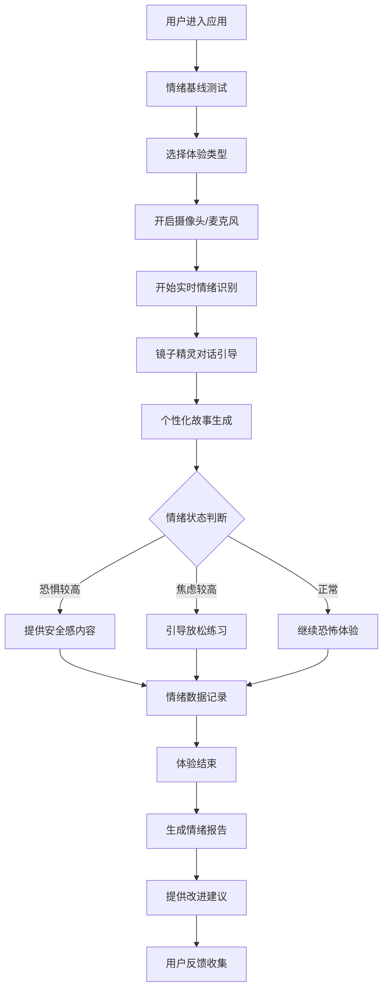
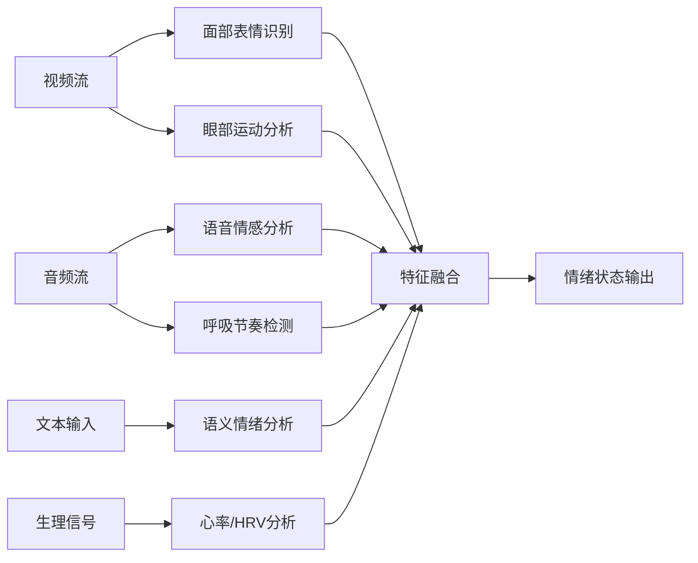
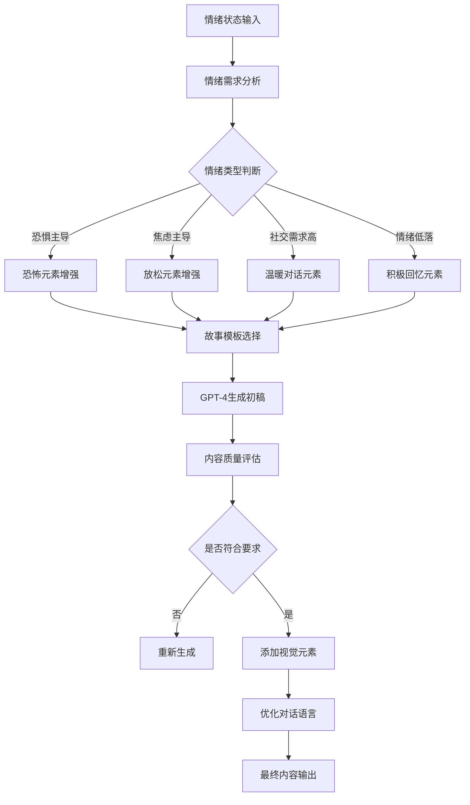

# 产品需求文档 (PRD)
## 方案二：心镜 · 情绪魔镜

---

## 📋 文档信息

| 项目 | 内容 |
|------|------|
| **产品名称** | 心镜 · 情绪魔镜 |
| **版本号** | v1.0 |
| **创建日期** | 2025-10-30 |
| **产品负责人** | [待定] |
| **技术负责人** | [待定] |
| **文档类型** | 产品需求文档 (PRD) |

---

## 🎯 1. 产品概述

### 1.1 产品定义

**心镜·情绪魔镜** 是一款基于情绪识别的个性化恐怖体验平台，通过AI技术实时分析用户的情绪状态，动态生成专属的恐怖/治愈内容，帮助用户认识、接纳并转化内心情绪，实现心理健康成长。

### 1.2 产品愿景

打造全球首个情绪驱动的沉浸式心理疗愈平台，让恐惧成为成长的催化剂，让每个人都能与内心的情绪和解。

### 1.3 核心价值主张

- **情绪识别**：多维度实时分析用户情绪状态
- **个性化体验**：千人千面的专属恐怖/治愈旅程
- **情绪疗愈**：通过恐惧面对实现心理成长
- **美学转化**：将负面情绪转化为艺术体验

---

## 🎯 2. 产品定位与目标

### 2.1 市场定位

面向18-35岁年轻群体的情绪健康管理平台，结合娱乐与心理疗愈的创新产品。

### 2.2 产品目标

#### 2.2.1 商业目标
- **短期目标（3个月）**：完成MVP开发，获得1000名种子用户
- **中期目标（6个月）**：用户量达到10,000人，实现收支平衡
- **长期目标（12个月）**：成为情绪健康管理领域的知名品牌

#### 2.2.2 用户目标
- 帮助用户识别和接纳自己的情绪
- 通过沉浸式体验降低焦虑、恐惧等负面情绪
- 提升用户的情绪管理能力和心理健康水平

#### 2.2.3 技术目标
- 情绪识别准确率达到85%以上
- 故事生成响应时间控制在3秒内
- 系统可用性达到99.9%

---

## 👥 3. 用户画像

### 3.1 主要用户群体

#### 3.1.1 年轻白领（25-35岁）
**用户特征**：
- 工作压力大，焦虑情绪明显
- 追求个性化和科技感的体验
- 愿意为心理健康投资

**使用场景**：
- 下班后在家使用，缓解工作压力
- 周末与朋友一起体验，作为社交活动
- 感到焦虑时寻求情绪疏导

#### 3.1.2 大学生群体（18-25岁）
**用户特征**：
- 对新技术接受度高
- 面临学业、就业压力，情绪波动大
- 寻求自我成长和情绪管理方法

**使用场景**：
- 宿舍夜间使用，释放学业压力
- 社团活动中的创新体验项目
- 情绪低落时的自我调节工具

#### 3.1.3 心理健康关注者
**用户特征**：
- 有明确的心理健康需求
- 了解情绪管理的重要性
- 愿意尝试新颖的心理疗愈方式

**使用场景**：
- 定期使用进行情绪健康检查
- 配合专业心理治疗师进行辅助治疗
- 学习情绪管理技巧

### 3.2 用户需求分析

#### 3.2.1 核心需求 (Must Have)
- 准确识别我的情绪状态
- 提供个性化的情绪调节内容
- 保护我的隐私和数据安全
- 简单易用的操作界面

#### 3.2.2 重要需求 (Should Have)
- 情绪历史记录和趋势分析
- 多场景的情绪体验内容
- 与专业心理机构的合作
- 情绪管理的学习资源

#### 3.2.3 期望需求 (Could Have)
- 社区功能，与其他用户分享体验
- 专家咨询和指导服务
- 线下活动和体验店
- 企业版员工心理健康服务

---

## ⚙️ 4. 功能需求

### 4.1 核心功能模块

#### 4.1.1 情绪识别模块

**功能描述**：实时采集和分析用户的情绪状态，包括面部表情、心率、语音等多个维度。

**功能点**：
- **面部表情识别**
  - 摄像头实时采集用户面部画面
  - 识别7种基础情绪：快乐、悲伤、愤怒、恐惧、惊讶、厌恶、中性
  - 情绪强度分级（0-100分）
  - 识别准确率 ≥ 85%

- **心率检测**
  - 通过摄像头PPG技术检测心率
  - 心率变异性分析（HRV）
  - 基于生理指标判断压力水平
  - 数据采样频率：30fps

- **语音情感分析**
  - 麦克风实时采集语音
  - 分析语音的音调、语速、颤动等特征
  - 识别语音中的情绪状态
  - 支持中文语音识别

- **文本情绪挖掘**
  - 分析用户在对话框输入的文本内容
  - 关键词和语义情感分析
  - 支持中英文混合文本

**数据输出**：
```
{
  "user_id": "uuid",
  "timestamp": "2025-10-30T12:00:00",
  "emotion": {
    "fear": 75,
    "anxiety": 60,
    "curiosity": 40,
    "social_need": 30
  },
  "physiology": {
    "heart_rate": 95,
    "hrv_score": 0.65,
    "voice_tremor": 0.3
  },
  "confidence": 0.87
}
```

#### 4.1.2 故事生成模块

**功能描述**：基于用户情绪状态，AI实时生成个性化的恐怖/治愈内容。

**功能点**：

- **情绪状态判断**
  - 综合分析多维度情绪数据
  - 判断用户当前情绪状态和需求
  - 预测情绪变化趋势
  - 决策周期：每30秒重新评估

- **内容动态生成**
  - 使用GPT-4生成个性化故事文本
  - 根据情绪类型选择故事主题和走向
  - 恐怖程度动态调整
  - 融入治愈元素

- **剧情走向调整**
  - 恐惧值高 → 提供安全感和鼓励
  - 焦虑值高 → 引导深呼吸和放松
  - 社交需求高 → 触发NPC温暖对话
  - 情绪低落 → 展现积极回忆片段

**故事模板示例**：

```
镜子精灵对话：
"我看到了你内心的恐惧..."
"它在说：我害怕被拒绝"
"但你看，你的勇气其实更大"
[播放用户勇敢面对困难的画面]
"现在，告诉我，你最怕什么？"
```

**性能要求**：
- 内容生成响应时间 ≤ 3秒
- 故事连贯性评分 ≥ 4.0/5.0
- 个性化匹配度 ≥ 80%

#### 4.1.3 镜子对话机制

**功能描述**：AI扮演"镜子精灵"与用户进行情绪对话，提供情绪疏导和心理支持。

**功能点**：

- **智能对话系统**
  - 基于情绪状态选择对话策略
  - 维护对话上下文和历史
  - 个性化语言风格和用词
  - 支持多轮深度对话

- **情绪疗愈对话**
  - 认知重构：帮助用户重新解读情绪
  - 情绪接纳：引导用户接纳负面情绪
  - 正念练习：提供冥想和放松指导
  - 资源挖掘：发现用户的内在力量

- **记忆回溯**
  - 根据用户情绪历史，推荐相关回忆
  - 展示用户克服困难的过往经历
  - 构建积极自我认知

**对话示例**：

```
用户状态：恐惧=85, 焦虑=70, 信心=20

镜子精灵：
"我感受到了你的紧张，它正在你的胸口跳动。
但你知道吗？恐惧其实是勇气发出的信号。
让我带你看看你内心最勇敢的时刻..."
[显示用户曾经战胜困难的画面]

"每一次你选择面对而不是逃避，
你就已经比昨天的自己更强大了。"
```

#### 4.1.4 情绪数据可视化

**功能描述**：将用户的情绪状态以直观的方式展示，帮助用户理解自己的情绪模式。

**功能点**：

- **情绪仪表盘**
  - 实时显示当前情绪雷达图
  - 情绪强度动态变化曲线
  - 多维度情绪数据分析
  - 支持历史对比查看

- **情绪网络图**
  - 展示情绪之间的关联关系
  - 识别情绪触发因素
  - 发现情绪模式规律
  - 提供情绪改进建议

- **情绪趋势分析**
  - 周/月情绪变化趋势
  - 高频情绪类型统计
  - 情绪健康评分
  - 情绪管理进步追踪

**技术实现**：
- 使用D3.js和Chart.js绘制交互式图表
- WebGL渲染高性能3D情绪模型
- 支持数据导出和分享

#### 4.1.5 体验管理模块

**功能描述**：管理用户的沉浸式体验流程，包括场景切换、音效控制、内容推荐等。

**功能点**：

- **场景管理**
  - 多种虚拟场景选择（废弃医院、古堡、森林等）
  - 场景元素动态生成
  - 光影效果实时渲染
  - 支持VR/AR模式

- **音效系统**
  - 空间3D音效定位
  - 情绪适配的背景音乐
  - 动态音效强度调整
  - 个性化音效推荐

- **内容推荐引擎**
  - 基于情绪历史的个性化推荐
  - 内容偏好学习和优化
  - 新内容发现机制
  - 用户反馈循环优化

### 4.2 辅助功能模块

#### 4.2.1 用户档案系统

**功能点**：
- 用户基础信息管理
- 情绪历史记录存储（加密）
- 成长轨迹追踪
- 偏好标签系统
- 隐私设置管理

**数据模型**：

```
用户档案 {
  user_id: string
  created_at: timestamp
  profile: {
    nickname: string
    age_range: string  // 18-25, 26-30, 31-35, 36+
    gender: string
    interests: string[]
    psychological_concerns: string[]
  }
  emotion_history: EmotionRecord[]
  preferences: {
    story_themes: string[]
    trigger_warnings: string[]
    difficulty_level: number  // 1-5
    privacy_level: number     // 1-5
  }
  growth_metrics: {
    sessions_completed: number
    total_duration: number
    emotion_improvement_score: float
    last_active: timestamp
  }
}
```

#### 4.2.2 安全与隐私保护

**功能点**：
- 所有生物特征数据本地加密存储
- 符合GDPR和《个人信息保护法》要求
- 数据匿名化处理
- 用户可随时删除所有数据
- 定期安全审计

**隐私策略**：
- 情绪数据不与第三方共享
- 用户可选择数据保留期限
- 敏感数据采用端到端加密
- 提供详细的数据使用说明

---

## 🔧 5. 非功能需求

### 5.1 性能需求

| 指标类型 | 具体要求 | 测量标准 |
|----------|----------|----------|
| **响应时间** | 情绪识别 ≤ 500ms | 95%请求 |
| | 故事生成 ≤ 3秒 | 90%请求 |
| | 界面加载 ≤ 2秒 | 首次加载 |
| **吞吐量** | 支持1000+并发用户 | 峰值时段 |
| **资源占用** | CPU使用率 ≤ 70% | 平均负载 |
| | 内存使用 ≤ 4GB | 单用户会话 |
| | 网络带宽 ≤ 2Mbps | 标清模式 |

### 5.2 可用性需求

- **系统可用性**：99.9%（年度停机时间 ≤ 8.76小时）
- **故障恢复时间**：≤ 30分钟（重大故障）
- **数据备份**：每日自动备份，保留30天
- **容灾能力**：支持异地灾备，RPO ≤ 1小时，RTO ≤ 4小时

### 5.3 安全需求

- **数据加密**：传输层TLS 1.3，存储层AES-256
- **访问控制**：基于角色的权限管理（RBAC）
- **身份认证**：支持多因素认证（MFA）
- **安全审计**：记录所有敏感操作日志
- **漏洞管理**：季度安全扫描，及时修复高危漏洞

### 5.4 兼容性需求

- **浏览器支持**：Chrome 90+, Firefox 88+, Safari 14+, Edge 90+
- **移动设备**：iOS 14+, Android 10+
- **VR设备**：Oculus Quest 2, HTC Vive, PICO 4
- **摄像头分辨率**：最低720p，推荐1080p
- **网络要求**：带宽 ≥ 5Mbps，延迟 ≤ 100ms

### 5.5 可维护性需求

- **代码质量**：单元测试覆盖率 ≥ 80%
- **文档完整性**：API文档、技术文档、用户手册完整
- **日志系统**：结构化日志，支持ELK stack
- **监控告警**：关键指标实时监控，自动告警
- **版本管理**：采用GitFlow，发布周期2周

---

## 🏗️ 6. 技术架构

### 6.1 整体架构图

```
┌─────────────────────────────────────────────────────────────┐
│                        用户层                                │
│  ┌───────────┐  ┌───────────┐  ┌───────────┐  ┌───────────┐ │
│  │  Web前端  │  │ 移动App   │  │  VR设备   │  │  AR设备   │ │
│  └───────────┘  └───────────┘  └───────────┘  └───────────┘ │
└─────────────────────────────────────────────────────────────┘
                              │
                      HTTPS/WebSocket
                              │
┌─────────────────────────────────────────────────────────────┐
│                      API网关层                               │
│  ┌─────────────────────────────────────────────────────────┐ │
│  │           Kong/Nginx - 请求路由、限流、鉴权              │ │
│  └─────────────────────────────────────────────────────────┘ │
└─────────────────────────────────────────────────────────────┘
                              │
┌─────────────────────────────────────────────────────────────┐
│                      业务逻辑层                              │
│  ┌──────────────┐ ┌──────────────┐ ┌────────────────────────┐ │
│  │ 情绪识别服务  │ │ 故事生成服务 │ │    对话管理服务        │ │
│  └──────────────┘ └──────────────┘ └────────────────────────┘ │
│  ┌──────────────┐ ┌──────────────┐ ┌────────────────────────┐ │
│  │ 用户档案服务  │ │ 可视化服务   │ │    体验管理服务        │ │
│  └──────────────┘ └──────────────┘ └────────────────────────┘ │
└─────────────────────────────────────────────────────────────┘
                              │
┌─────────────────────────────────────────────────────────────┐
│                      AI服务层                                │
│  ┌──────────────┐ ┌──────────────┐ ┌────────────────────────┐ │
│  │ GPT-4 API    │ │ Stable Diffusion│ │  face-api.js         │ │
│  └──────────────┘ └──────────────┘ └────────────────────────┘ │
│  ┌──────────────┐ ┌──────────────┐ ┌────────────────────────┐ │
│  │ ElevenLabs   │ │ TensorFlow.js │ │   自训练情绪模型       │ │
│  └──────────────┘ └──────────────┘ └────────────────────────┘ │
└─────────────────────────────────────────────────────────────┘
                              │
┌─────────────────────────────────────────────────────────────┐
│                      数据存储层                              │
│  ┌──────────────┐ ┌──────────────┐ ┌────────────────────────┐ │
│  │ PostgreSQL   │ │ Redis Cache  │ │    MongoDB             │ │
│  │ (主数据库)    │ │ (会话缓存)    │ │ (文档存储)             │ │
│  └──────────────┘ └──────────────┘ └────────────────────────┘ │
│  ┌──────────────┐ ┌──────────────┐ ┌────────────────────────┐ │
│  │  MinIO       │ │ Elasticsearch│ │    InfluxDB            │ │
│  │ (文件存储)    │ │ (日志分析)    │ │ (时序数据)             │ │
│  └──────────────┘ └──────────────┘ └────────────────────────┘ │
└─────────────────────────────────────────────────────────────┘
```

### 6.2 前端架构

#### 6.2.1 Web前端技术栈

**核心技术**：
- **框架**：React 18 + TypeScript
- **状态管理**：Redux Toolkit + RTK Query
- **3D渲染**：Three.js + A-Frame
- **情绪识别**：TensorFlow.js + face-api.js
- **数据可视化**：D3.js + Chart.js + ECharts
- **WebRTC**：实时音视频通信
- **WebGL**：高性能图形渲染

**项目结构**：

```
src/
├── components/           # 可复用组件
│   ├── EmotionDetector/  # 情绪检测组件
│   ├── StoryViewer/      # 故事展示组件
│   ├── EmotionChart/     # 情绪图表组件
│   └── MirrorDialog/     # 镜子对话组件
├── pages/               # 页面组件
│   ├── Home/            # 首页
│   ├── Experience/      # 体验页面
│   ├── Dashboard/       # 数据看板
│   └── Profile/         # 个人中心
├── services/            # API服务
│   ├── emotion/         # 情绪识别服务
│   ├── story/           # 故事生成服务
│   └── user/            # 用户管理服务
├── store/               # Redux状态
├── hooks/               # 自定义Hook
├── utils/               # 工具函数
└── types/               # TypeScript类型定义
```

#### 6.2.2 移动端架构

**技术选型**：
- **框架**：React Native 0.72+
- **导航**：React Navigation 6
- **状态管理**：Redux Toolkit
- **原生模块**：OpenCV for 摄像头处理
- **实时通信**：Socket.IO

**功能特性**：
- 响应式设计，支持各种屏幕尺寸
- 离线模式支持，缓存核心功能
- 推送通知，情绪关怀提醒
- 手势交互，提升用户体验

#### 6.2.3 VR/AR集成

**技术方案**：
- **WebXR**：基于浏览器的VR/AR体验
- **A-Frame**：快速VR场景开发
- **ARCore/ARKit**：原生AR功能
- **Three.js**：3D场景渲染

**交互设计**：
- 手势控制：抓取、指向、触摸
- 语音控制：免手动操作
- 眼球追踪：注意力检测
- 触觉反馈：增强沉浸感

### 6.3 后端架构

#### 6.3.1 技术选型

**核心框架**：
- **语言**：Python 3.11+
- **Web框架**：FastAPI
- **异步支持**：asyncio + aiohttp
- **数据库ORM**：SQLAlchemy + Alembic
- **任务队列**：Celery + Redis
- **消息队列**：RabbitMQ

**AI/ML框架**：
- **深度学习**：PyTorch + Transformers
- **数据处理**：Pandas + NumPy
- **模型服务**：TorchServe + NVIDIA Triton
- **特征工程**：scikit-learn

#### 6.3.2 服务拆分

**微服务架构**：

```
用户服务 (User Service)
├── 用户注册/登录
├── 档案管理
├── 权限控制
└── 偏好设置

情绪识别服务 (Emotion Service)
├── 多模态数据采集
├── 特征提取
├── 情绪分类
└── 置信度计算

故事生成服务 (Story Service)
├── 情绪状态分析
├── 内容生成
├── 个性化推荐
└── 质量评估

对话管理服务 (Dialog Service)
├── 对话上下文管理
├── 策略选择
├── 响应生成
└── 对话评估

可视化服务 (Visualization Service)
├── 情绪数据聚合
├── 图表生成
├── 趋势分析
└── 报告导出

体验管理服务 (Experience Service)
├── 场景管理
├── 流程控制
├── 内容分发
└── 用户反馈
```

#### 6.3.3 API设计规范

**RESTful API示例**：

```
# 情绪识别
POST /api/v1/emotion/analyze
Body: {
  "user_id": "uuid",
  "video_stream": "base64",  # 可选
  "audio_stream": "base64",  # 可选
  "text_input": "string"     # 可选
}
Response: {
  "emotion_scores": {...},
  "physiology": {...},
  "confidence": 0.87
}

# 故事生成
POST /api/v1/story/generate
Body: {
  "user_id": "uuid",
  "emotion_state": {...},
  "theme": "horror|healing",
  "length": "short|medium|long"
}
Response: {
  "story_id": "uuid",
  "content": "string",
  "visual_elements": [...],
  "estimated_duration": 300
}

# 情绪历史
GET /api/v1/emotion/history?user_id=xxx&start=xxx&end=xxx
Response: {
  "records": [...],
  "trend": "improving|stable|declining",
  "insights": [...]
}
```

**WebSocket API**：

```javascript
// 实时情绪数据推送
{
  "type": "emotion_update",
  "user_id": "uuid",
  "data": {
    "fear": 75,
    "anxiety": 60,
    ...
  }
}

// 镜子对话消息
{
  "type": "mirror_message",
  "content": "我感受到了你的紧张...",
  "emotion_state": {...}
}
```

### 6.4 数据架构

#### 6.4.1 数据模型

**核心数据表设计**：

```sql
-- 用户表
CREATE TABLE users (
  id UUID PRIMARY KEY,
  email VARCHAR(255) UNIQUE NOT NULL,
  nickname VARCHAR(100),
  created_at TIMESTAMP DEFAULT NOW(),
  updated_at TIMESTAMP DEFAULT NOW()
);

-- 情绪记录表
CREATE TABLE emotion_records (
  id UUID PRIMARY KEY,
  user_id UUID REFERENCES users(id),
  session_id UUID,
  timestamp TIMESTAMP NOT NULL,
  emotion_scores JSONB NOT NULL,  -- 多维度情绪分数
  physiology JSONB,               -- 生理指标
  confidence FLOAT,               -- 识别置信度
  context TEXT                    -- 场景上下文
);

-- 故事内容表
CREATE TABLE stories (
  id UUID PRIMARY KEY,
  user_id UUID REFERENCES users(id),
  title VARCHAR(200),
  content TEXT NOT NULL,
  theme VARCHAR(50),
  emotion_trigger JSONB,
  user_rating FLOAT,
  created_at TIMESTAMP DEFAULT NOW()
);

-- 对话记录表
CREATE TABLE conversations (
  id UUID PRIMARY KEY,
  user_id UUID REFERENCES users(id),
  story_id UUID REFERENCES stories(id),
  messages JSONB NOT NULL,  -- 对话消息数组
  emotion_progression JSONB, -- 情绪变化轨迹
  duration INTEGER,         -- 对话时长（秒）
  created_at TIMESTAMP DEFAULT NOW()
);

-- 体验会话表
CREATE TABLE sessions (
  id UUID PRIMARY KEY,
  user_id UUID REFERENCES users(id),
  start_time TIMESTAMP NOT NULL,
  end_time TIMESTAMP,
  experience_type VARCHAR(50),  -- horror, healing, mixed
  emotion_changes JSONB,        -- 情绪变化数据
  completion_rate FLOAT         -- 完成度
);
```

#### 6.4.2 数据流程

```
数据采集 → 预处理 → 特征提取 → 情绪分析 → 内容生成 → 用户反馈 → 模型优化
    ↓           ↓          ↓          ↓          ↓          ↓          ↓
  多模态     数据清洗    特征工程    情绪分类    故事生成    评分反馈    模型更新
  原始数据    标准化     降维       多标签      内容推荐    权重调整    在线学习
```

### 6.5 部署架构

#### 6.5.1 容器化部署

**Docker配置**：

```dockerfile
# 后端服务 Dockerfile
FROM python:3.11-slim

WORKDIR /app

COPY requirements.txt .
RUN pip install -r requirements.txt

COPY . .
EXPOSE 8000

CMD ["uvicorn", "main:app", "--host", "0.0.0.0", "--port", "8000"]
```

#### 6.5.2 Kubernetes编排

```yaml
apiVersion: apps/v1
kind: Deployment
metadata:
  name: emotion-service
spec:
  replicas: 3
  selector:
    matchLabels:
      app: emotion-service
  template:
    metadata:
      labels:
        app: emotion-service
    spec:
      containers:
      - name: emotion-service
        image: emotion-service:latest
        ports:
        - containerPort: 8000
        resources:
          requests:
            memory: "1Gi"
            cpu: "500m"
          limits:
            memory: "2Gi"
            cpu: "1000m"
```

#### 6.5.3 CI/CD流程

```
Git Push → GitHub Actions → Docker Build → Docker Push → Kubernetes Deploy
                ↓              ↓             ↓             ↓           ↓
           代码检查      单元测试       镜像构建      镜像推送     自动部署
           安全扫描      集成测试       漏洞扫描      版本标记     健康检查
```

---

## 🔄 7. 业务流程

### 7.1 用户使用流程

#### 7.1.1 完整体验流程



#### 7.1.2 新用户引导流程

**Step 1: 欢迎与介绍**
- 产品介绍视频（2分钟）
- 核心功能亮点展示
- 隐私保护承诺说明
- 用户协议确认

**Step 2: 账户创建**
- 邮箱/手机号注册
- 密码设置
- 验证码验证
- 基础信息填写（昵称、年龄范围）

**Step 3: 权限授权**
- 摄像头权限申请
- 麦克风权限申请
- 存储权限申请
- 通知权限申请

**Step 4: 设备测试**
- 摄像头画面检测
- 音频输入测试
- 网络速度检测
- 浏览器兼容性检查

**Step 5: 基线测试**
- 情绪识别准确性测试
- 心率检测功能验证
- 系统响应速度评估
- 生成个性化基线档案

**Step 6: 首次体验**
- 推荐适合的初始场景
- 简化版镜子对话
- 短时间体验（5分钟）
- 体验反馈收集

### 7.2 情绪识别业务流程

#### 7.2.1 多模态数据融合流程



#### 7.2.2 实时处理流程

1. **数据采集**（30fps）
   - 摄像头捕获720p视频帧
   - 麦克风采集16kHz音频
   - 实时键盘输入监听

2. **预处理**
   - 视频帧：人脸检测 → 关键点标注 → 标准化
   - 音频：降噪 → 分帧 → 特征提取（MFCC）
   - 文本：分词 → 词性标注 → 语义分析

3. **特征提取**
   - 面部表情：7种基础情绪特征向量
   - 语音：音调、语速、颤动特征
   - 文本：情感词典 + 深度学习嵌入

4. **模型推理**
   - 多模态融合模型
   - 时序网络（LSTM/Transformer）
   - 注意力机制加权

5. **置信度评估**
   - 数据质量评分
   - 模型输出置信度
   - 异常值检测

6. **结果输出**
   - 多维度情绪分数（0-100）
   - 生理健康指标
   - 综合置信度（0-1）

### 7.3 故事生成业务流程

#### 7.3.1 内容生成流程



#### 7.3.2 个性化推荐流程

**用户画像构建**：
- 基础属性：年龄、性别、兴趣
- 情绪特征：高频情绪、情绪波动模式
- 偏好标签：故事类型、恐怖程度、治愈元素
- 历史行为：完成率、评分、停留时间

**推荐算法**：
1. **协同过滤**：基于相似用户的偏好
2. **内容推荐**：基于用户标签匹配
3. **深度学习**：Neural Collaborative Filtering
4. **混合推荐**：加权组合多种算法

**推荐效果评估**：
- 点击率（CTR）
- 完成率
- 用户评分
- 情绪改善度

---

## 🎨 8. UI/UX设计要求

### 8.1 设计原则

#### 8.1.1 情绪感知设计
- **色彩心理学**：根据情绪状态动态调整界面配色
  - 恐惧状态：深蓝、紫色（提供安全感）
  - 焦虑状态：绿色、蓝色（平静放松）
  - 情绪低落：暖色调（橙、黄激发活力）
- **视觉层次**：重要信息突出，次要信息弱化
- **动态反馈**：实时反映用户情绪状态

#### 8.1.2 沉浸式体验
- **极简主义**：减少视觉干扰，聚焦核心内容
- **空间感**：利用3D效果增强沉浸感
- **过渡动画**：流畅的场景切换和状态变化
- **音效配合**：视觉与听觉的一致性

#### 8.1.3 无障碍设计
- **对比度**：符合WCAG 2.1 AA标准（≥ 4.5:1）
- **字体大小**：支持120%-200%缩放
- **键盘导航**：所有功能支持键盘操作
- **语义化标签**：完整的ARIA标签支持

### 8.2 关键页面设计

#### 8.2.1 情绪识别界面

**布局结构**：
```
┌─────────────────────────────────────┐
│  🪞 心镜·情绪魔镜                    │
├─────────────────────────────────────┤
│                                     │
│  ┌───────────┐      ┌─────────────┐ │
│  │           │      │             │ │
│  │  摄像头   │      │  情绪雷达图 │ │
│  │  画面     │      │             │ │
│  │           │      │             │ │
│  └───────────┘      └─────────────┘ │
│                                     │
│  当前情绪：恐惧 75% | 焦虑 60%      │
│  💙 保持冷静，你比想象中更勇敢        │
│                                     │
│  [🎵 音效控制] [⚙️ 设置] [❓ 帮助]   │
└─────────────────────────────────────┘
```

**交互细节**：
- 情绪雷达图实时更新（每秒1次）
- 摄像头边框颜色随情绪变化
- 鼓励文字根据情绪状态动态生成
- 情绪分数用动画效果展示

#### 8.2.2 镜子对话界面

**布局结构**：
```
┌─────────────────────────────────────┐
│                                     │
│  ┌─────────────────────────────────┐ │
│  │                                 │ │
│  │         虚拟镜子场景              │ │
│  │                                 │ │
│  └─────────────────────────────────┘ │
│                                     │
│  镜子精灵：                         │
│  💬 "我看到了你内心的恐惧..."        │
│     "它在说：我害怕被拒绝"           │
│     "但你看，你的勇气其实更大"       │
│                                     │
│  ┌─────────────────────────────────┐ │
│  │ [输入你的感受...]               │ │
│  └─────────────────────────────────┘ │
│                                     │
│  [🎤 语音输入] [😊 快捷回复]        │
└─────────────────────────────────────┘
```

**交互细节**：
- 镜子表面有微妙的光影反射效果
- 对话气泡逐字出现，模拟真实对话
- 支持语音输入（实时转文字）
- 快捷回复按钮随情绪状态变化

#### 8.2.3 情绪数据看板

**布局结构**：
```
┌─────────────────────────────────────┐
│  📊 我的情绪档案                      │
├─────────────────────────────────────┤
│                                     │
│  本周情绪趋势                        │
│  ┌─────────────────────────────────┐ │
│  │        📈 趋势图表              │ │
│  └─────────────────────────────────┘ │
│                                     │
│  情绪分布        高频情绪            │
│  🟥 恐惧 35%      😰 焦虑           │
│  🟨 焦虑 28%      😢 悲伤           │
│  🟩 平静 20%      😊 快乐           │
│  🟦 好奇 17%      😡 愤怒           │
│                                     │
│  💡 本周洞察：                        │
│  • 你的恐惧指数较上周下降15%          │
│  • 周三晚上情绪波动较大               │
│  • 建议：多进行放松练习               │
│                                     │
│  [📤 导出报告] [🔒 隐私设置]          │
└─────────────────────────────────────┘
```

### 8.3 响应式设计

#### 8.3.1 断点设置

```scss
// 移动设备
$breakpoint-mobile: 480px;

// 平板设备
$breakpoint-tablet: 768px;

// 桌面设备
$breakpoint-desktop: 1024px;

// 大屏设备
$breakpoint-large: 1440px;
```

#### 8.3.2 适配策略

- **< 480px（手机竖屏）**
  - 单列布局
  - 底部导航
  - 简化图表展示
  - 手势交互优化

- **480px - 768px（手机横屏/小平板）**
  - 单列或双列布局
  - 侧边导航可收起
  - 图表支持缩放

- **768px - 1024px（平板/小笔记本）**
  - 双列布局
  - 侧边导航固定
  - 完整图表展示

- **> 1024px（桌面/大屏）**
  - 多列布局
  - 固定导航栏
  - 大屏数据可视化
  - 多窗口支持

### 8.4 主题与配色

#### 8.4.1 主色调方案

```scss
// 基础色彩
$primary-color: #6366F1;      // 主色：紫罗兰
$secondary-color: #8B5CF6;    // 辅色：紫色
$accent-color: #EC4899;       // 强调色：粉红

// 情绪色彩
$color-fear: #EF4444;         // 恐惧：红色
$color-anxiety: #F59E0B;      // 焦虑：橙色
$color-calm: #10B981;         // 平静：绿色
$color-joy: #F59E0B;          // 快乐：黄色
$color-curiosity: #3B82F6;    // 好奇：蓝色

// 中性色
$gray-50: #F9FAFB;
$gray-100: #F3F4F6;
$gray-200: #E5E7EB;
$gray-300: #D1D5DB;
$gray-400: #9CA3AF;
$gray-500: #6B7280;
$gray-600: #4B5563;
$gray-700: #374151;
$gray-800: #1F2937;
$gray-900: #111827;
```

#### 8.4.2 情绪主题切换

**平静主题**（默认）：
- 主色调：蓝色系
- 背景：浅蓝渐变
- 字体：深灰色

**温暖主题**（情绪低落时）：
- 主色调：橙黄色系
- 背景：暖色渐变
- 字体：深棕色

**冷静主题**（恐惧/焦虑时）：
- 主色调：深蓝紫色系
- 背景：深色渐变
- 字体：浅色

### 8.5 交互动效

#### 8.5.1 情绪数据动效

```javascript
// 情绪分数动画示例
const animateEmotionScore = (element, targetValue) => {
  const duration = 1000; // 1秒
  const startTime = performance.now();
  const startValue = parseFloat(element.textContent) || 0;

  const update = (currentTime) => {
    const elapsed = currentTime - startTime;
    const progress = Math.min(elapsed / duration, 1);

    // 缓动函数：easeOutCubic
    const easedProgress = 1 - Math.pow(1 - progress, 3);
    const currentValue = startValue + (targetValue - startValue) * easedProgress;

    element.textContent = Math.round(currentValue);

    if (progress < 1) {
      requestAnimationFrame(update);
    }
  };

  requestAnimationFrame(update);
};
```

#### 8.5.2 场景切换动效

```javascript
// 故事场景过渡动画
const transitionToNewScene = (newScene) => {
  // 淡出当前场景
  currentScene.style.opacity = '0';
  currentScene.style.transform = 'scale(0.95)';

  // 延迟500ms后加载新场景
  setTimeout(() => {
    currentScene.style.display = 'none';
    newScene.style.display = 'block';

    // 淡入新场景
    requestAnimationFrame(() => {
      newScene.style.transition = 'all 0.5s ease';
      newScene.style.opacity = '1';
      newScene.style.transform = 'scale(1)';
    });
  }, 500);
};
```

---

## 📊 9. 数据流设计

### 9.1 数据采集层

#### 9.1.1 多模态数据采集

**视频数据流**：
```
摄像头 → Canvas采集 → Base64编码 → WebSocket发送
                    ↓
                本地缓存（30秒循环）
```

**音频数据流**：
```
麦克风 → MediaRecorder → PCM数据 → WebSocket发送
                    ↓
                本地缓存（10秒循环）
```

**生理数据流**：
```
心率传感器 → 实时读取 → 数值平滑 → HTTP POST
                      ↓
                  数据去噪处理
```

#### 9.1.2 数据采集频率

| 数据类型 | 采样频率 | 数据量 | 传输方式 |
|----------|----------|--------|----------|
| 视频帧 | 30fps | 2MB/s | WebSocket |
| 音频 | 16kHz | 256KB/s | WebSocket |
| 心率 | 1Hz | 1KB/s | HTTP |
| 文本输入 | 事件触发 | <1KB | WebSocket |
| 设备状态 | 5s一次 | <1KB | HTTP |

### 9.2 数据传输层

#### 9.2.1 WebSocket连接管理

**连接建立**：
```javascript
const socket = new WebSocket('wss://api.emotion-mirror.com/ws');

// 连接握手
{
  type: 'handshake',
  user_id: 'uuid',
  device_info: {...},
  auth_token: 'jwt_token'
}

// 服务器确认
{
  type: 'connected',
  session_id: 'uuid',
  protocol_version: '1.0'
}
```

**数据传输协议**：
```javascript
// 情绪数据包
{
  type: 'emotion_data',
  timestamp: 1635724800000,
  data: {
    emotion_scores: { fear: 75, anxiety: 60 },
    physiology: { heart_rate: 95 },
    confidence: 0.87
  }
}

// 视频帧数据包
{
  type: 'video_frame',
  timestamp: 1635724800000,
  frame_id: 1,
  image_data: 'base64_encoded_jpeg',
  compression: 0.7
}

// 音频数据包
{
  type: 'audio_chunk',
  timestamp: 1635724800000,
  duration: 100, // ms
  audio_data: 'base64_encoded_pcm',
  sample_rate: 16000
}
```

#### 9.2.2 断线重连机制

```javascript
class WebSocketManager {
  constructor(url) {
    this.url = url;
    this.reconnectInterval = 5000; // 5秒
    this.maxReconnectAttempts = 10;
    this.reconnectAttempts = 0;
  }

  connect() {
    this.socket = new WebSocket(this.url);

    this.socket.onopen = () => {
      console.log('WebSocket连接建立');
      this.reconnectAttempts = 0;
      this.heartbeat();
    };

    this.socket.onclose = () => {
      console.log('WebSocket连接关闭');
      this.reconnect();
    };

    this.socket.onerror = (error) => {
      console.error('WebSocket错误', error);
    };
  }

  reconnect() {
    if (this.reconnectAttempts < this.maxReconnectAttempts) {
      this.reconnectAttempts++;
      console.log(`尝试重连 (${this.reconnectAttempts}/${this.maxReconnectAttempts})`);
      setTimeout(() => this.connect(), this.reconnectInterval);
    } else {
      console.error('达到最大重连次数，停止重连');
    }
  }

  heartbeat() {
    setInterval(() => {
      if (this.socket.readyState === WebSocket.OPEN) {
        this.socket.send(JSON.stringify({ type: 'ping' }));
      }
    }, 30000);
  }
}
```

### 9.3 数据处理层

#### 9.3.1 实时处理流水线

```
原始数据 → 预处理 → 特征提取 → 模型推理 → 结果后处理 → 存储
    ↓         ↓         ↓         ↓         ↓         ↓
  多模态    数据清洗   时序特征   深度学习   置信度评估  数据库
  输入      标准化     提取       模型       异常检测   写入
```

#### 9.3.2 异步任务处理

**Celery任务队列配置**：

```python
# tasks.py
from celery import Celery

app = Celery('emotion_service')

@app.task(bind=True)
def process_emotion_data(self, user_id, emotion_data):
    """异步处理情绪数据"""
    try:
        # 数据清洗
        cleaned_data = clean_emotion_data(emotion_data)

        # 特征提取
        features = extract_features(cleaned_data)

        # 情绪分类
        emotion_result = emotion_classifier.predict(features)

        # 保存到数据库
        save_emotion_record(user_id, emotion_result)

        # 触发故事生成
        if emotion_result['fear'] > 70:
            generate_comforting_story.delay(user_id, emotion_result)

        return emotion_result
    except Exception as exc:
        # 任务失败，重试3次
        raise self.retry(exc=exc, countdown=60, max_retries=3)
```

#### 9.3.3 数据缓存策略

**Redis缓存配置**：

```python
import redis

redis_client = redis.Redis(host='redis', port=6379, db=0)

# 用户实时情绪数据（缓存1分钟）
def cache_realtime_emotion(user_id, emotion_data):
    key = f"emotion:realtime:{user_id}"
    redis_client.setex(key, 60, json.dumps(emotion_data))

# 获取实时情绪
def get_realtime_emotion(user_id):
    key = f"emotion:realtime:{user_id}"
    data = redis_client.get(key)
    return json.loads(data) if data else None

# 情绪基线数据（缓存24小时）
def cache_emotion_baseline(user_id, baseline):
    key = f"emotion:baseline:{user_id}"
    redis_client.setex(key, 86400, json.dumps(baseline))

# 故事内容缓存（缓存7天）
def cache_generated_story(story_id, content):
    key = f"story:content:{story_id}"
    redis_client.setex(key, 604800, json.dumps(content))
```

### 9.4 数据存储层

#### 9.4.1 数据库选择

**PostgreSQL**（主数据库）：
- 用户档案、账户信息
- 情绪历史记录
- 故事内容
- 对话记录

**MongoDB**（文档存储）：
- 非结构化数据
- 复杂查询场景
- 快速迭代需求

**InfluxDB**（时序数据库）：
- 实时情绪数据流
- 高频传感器数据
- 时间序列分析

**MinIO**（对象存储）：
- 视频录制文件
- 音频记录
- 图片资源

#### 9.4.2 数据模型设计

**EmotionRecord模型**：

```python
from sqlalchemy import Column, UUID, JSONB, Float, DateTime
from sqlalchemy.ext.declarative import declarative_base

Base = declarative_base()

class EmotionRecord(Base):
    __tablename__ = 'emotion_records'

    id = Column(UUID, primary_key=True)
    user_id = Column(UUID, nullable=False, index=True)
    session_id = Column(UUID, nullable=True, index=True)
    timestamp = Column(DateTime, nullable=False, index=True)

    # 多维度情绪分数
    emotion_scores = Column(JSONB, nullable=False)
    # 格式: {"fear": 75, "anxiety": 60, "curiosity": 40}

    # 生理指标
    physiology = Column(JSONB)
    # 格式: {"heart_rate": 95, "hrv_score": 0.65}

    # 识别置信度
    confidence = Column(Float, nullable=False)

    # 场景上下文
    context = Column(JSONB)
    # 格式: {"scene": "mirror", "activity": "dialogue"}
```

**Story模型**：

```python
class Story(Base):
    __tablename__ = 'stories'

    id = Column(UUID, primary_key=True)
    user_id = Column(UUID, nullable=False, index=True)
    emotion_trigger = Column(JSONB, nullable=False)
    # 触发的情绪状态

    title = Column(String(200))
    content = Column(Text, nullable=False)
    theme = Column(String(50))  # horror, healing, neutral

    # 生成参数
    generation_params = Column(JSONB)
    # 格式: {"gpt_model": "gpt-4", "temperature": 0.7}

    # 用户反馈
    user_rating = Column(Float)
    feedback_text = Column(Text)

    # 元数据
    created_at = Column(DateTime, default=func.now())
    word_count = Column(Integer)
    reading_time = Column(Integer)  # 秒
```

#### 9.4.3 数据分区策略

**按时间分区**（适用于时序数据）：

```sql
-- 创建按月分区的表
CREATE TABLE emotion_records_2025_10 PARTITION OF emotion_records
FOR VALUES FROM ('2025-10-01') TO ('2025-11-01');

CREATE TABLE emotion_records_2025_11 PARTITION OF emotion_records
FOR VALUES FROM ('2025-11-01') TO ('2025-12-01');

-- 每月自动创建分区
CREATE OR REPLACE FUNCTION create_monthly_partition()
RETURNS void AS $$
DECLARE
    start_date date;
    end_date date;
    partition_name text;
BEGIN
    -- 创建下个月的分区
    start_date := date_trunc('month', CURRENT_DATE) + INTERVAL '1 month';
    end_date := start_date + INTERVAL '1 month';
    partition_name := 'emotion_records_' ||
                      to_char(start_date, 'YYYY_MM');

    EXECUTE format(
        'CREATE TABLE IF NOT EXISTS %I PARTITION OF emotion_records
         FOR VALUES FROM (%L) TO (%L)',
        partition_name, start_date, end_date
    );
END;
$$ LANGUAGE plpgsql;
```

### 9.5 数据安全与隐私

#### 9.5.1 加密策略

**传输加密**：
- HTTPS/TLS 1.3
- WebSocket WSS
- 证书自动续期

**存储加密**：
```python
from cryptography.fernet import Fernet

# 敏感数据加密
def encrypt_sensitive_data(data: str, key: bytes) -> str:
    f = Fernet(key)
    encrypted_data = f.encrypt(data.encode())
    return encrypted_data.decode()

# 敏感数据解密
def decrypt_sensitive_data(encrypted_data: str, key: bytes) -> str:
    f = Fernet(key)
    decrypted_data = f.decrypt(encrypted_data.encode())
    return decrypted_data.decode()
```

**字段级加密**：
```sql
-- 使用pgp_sym_encrypt加密敏感字段
CREATE TABLE users (
  id UUID PRIMARY KEY,
  email TEXT,
  encrypted_phone TEXT ENCRYPTED WITH (column_encryption_key = phone_key),
  created_at TIMESTAMP DEFAULT NOW()
);
```

#### 9.5.2 访问控制

**基于角色的权限控制（RBAC）**：

```python
from functools import wraps
from flask import request, jsonify

def require_permission(permission):
    def decorator(f):
        @wraps(f)
        def decorated_function(*args, **kwargs):
            user = get_current_user()
            if not user.has_permission(permission):
                return jsonify({'error': 'Permission denied'}), 403
            return f(*args, **kwargs)
        return decorated_function
    return decorator

# 使用示例
@app.route('/api/v1/emotion/history')
@require_permission('view_emotion_data')
def get_emotion_history():
    # 获取情绪历史数据
    pass
```

**API限流**：

```python
from flask_limiter import Limiter
from flask_limiter.util import get_remote_address

limiter = Limiter(
    app,
    key_func=get_remote_address,
    default_limits=["200 per day", "50 per hour"]
)

@app.route('/api/v1/emotion/analyze')
@limiter.limit("10 per minute")
def analyze_emotion():
    # 情绪分析接口
    pass
```

#### 9.5.3 数据脱敏

**日志脱敏**：

```python
import re

def mask_sensitive_data(log_message: str) -> str:
    # 脱敏邮箱
    log_message = re.sub(
        r'\b[A-Za-z0-9._%+-]+@[A-Za-z0-9.-]+\.[A-Z|a-z]{2,}\b',
        '[EMAIL_MASKED]',
        log_message
    )

    # 脱敏用户ID
    log_message = re.sub(
        r'user_id[=:\s]+([a-f0-9-]{36})',
        r'user_id=\g<1>[USER_ID_MASKED]',
        log_message
    )

    return log_message

# 使用示例
logger.info(mask_sensitive_data(f"用户 {user_id} 开始情绪分析"))
```

**数据导出脱敏**：

```python
def export_user_data(user_id: str) -> dict:
    user_data = get_user_data(user_id)

    # 脱敏处理
    sanitized_data = {
        **user_data,
        'email': hash_email(user_data['email']),
        'phone': mask_phone(user_data['phone']),
        'emotion_records': anonymize_emotion_data(user_data['emotion_records'])
    }

    return sanitized_data
```

---

## 📅 10. 项目规划

### 10.1 开发阶段规划

#### 10.1.1 总体时间规划

| 阶段 | 时间周期 | 主要任务 | 交付物 |
|------|----------|----------|--------|
| **需求分析与设计** | 2周 | 需求确认、技术调研、架构设计、UI设计 | 完整PRD、技术方案、设计稿 |
| **MVP开发** | 8周 | 核心功能开发、基础UI实现 | 可运行MVP |
| **Alpha测试** | 2周 | 内部测试、Bug修复、性能优化 | Alpha版本 |
| **Beta开发** | 4周 | 完善功能、优化体验、集成测试 | Beta版本 |
| **Beta测试** | 2周 | 外部测试、用户反馈、迭代优化 | 正式版本 |
| **上线发布** | 1周 | 生产部署、监控配置、运营准备 | 线上产品 |

**总周期：19周（约4.5个月）**

#### 10.1.2 MVP阶段详细规划

**第1-2周：需求确认与设计**
- 用户访谈与需求验证
- 技术选型与架构设计
- 原型设计与评审
- 开发环境搭建

**第3-4周：情绪识别模块开发**
- 摄像头/麦克风集成
- face-api.js集成
- 基础情绪识别功能
- 简单UI实现

**第5-6周：故事生成模块开发**
- GPT-4 API集成
- 故事模板设计
- 情绪状态分析逻辑
- 内容生成优化

**第7-8周：镜子对话系统**
- 对话流程设计
- AI对话逻辑实现
- 对话界面开发
- 多轮对话测试

**第9-10周：数据可视化**
- 情绪数据图表开发
- 趋势分析算法
- 可视化界面设计
- 数据存储优化

#### 10.1.3 里程碑节点

| 时间节点 | 里程碑 | 验收标准 |
|----------|--------|----------|
| 第2周 | 设计评审通过 | 设计稿通过评审，开发环境就绪 |
| 第4周 | 情绪识别Demo | 能识别3种以上情绪，准确率>70% |
| 第6周 | 故事生成Demo | 能生成基础故事，响应时间<5秒 |
| 第8周 | 完整对话Demo | 10轮以上连续对话 |
| 第10周 | MVP发布 | 所有核心功能可用 |

### 10.2 资源分配

#### 10.2.1 团队配置

**核心团队（6人）**：

| 角色 | 人数 | 职责 | 技能要求 |
|------|------|------|----------|
| **产品经理** | 1 | 需求管理、项目推进、用户调研 | 产品设计、用户研究、项目管理 |
| **前端开发** | 2 | Web前端开发、UI实现、交互逻辑 | React、TypeScript、Three.js |
| **后端开发** | 2 | API开发、数据处理、AI集成 | Python、FastAPI、数据库 |
| **AI工程师** | 1 | 情绪识别模型、故事生成、算法优化 | 深度学习、NLP、PyTorch |

**扩展团队（可选）**：

| 角色 | 人数 | 职责 |
|------|------|------|
| UI/UX设计师 | 1 | 界面设计、交互设计、视觉规范 |
| 测试工程师 | 1 | 功能测试、性能测试、自动化测试 |
| 运维工程师 | 1 | 部署配置、监控告警、性能优化 |

#### 10.2.2 预算估算

| 成本类型 | 项目 | 预算（人民币） |
|----------|------|----------------|
| **人员成本** | 核心团队6人 × 4.5月 × 2万/月 | 54万 |
| **云服务** | 服务器、数据库、存储 | 3万/月 × 6月 = 18万 |
| **第三方API** | GPT-4、ElevenLabs、云计算资源 | 5万 |
| **软件许可** | 开发工具、设计软件 | 2万 |
| **硬件设备** | 测试设备、摄像头、麦克风 | 3万 |
| **其他** | 办公费用、出差、培训 | 3万 |
| **总计** | | **85万** |

### 10.3 风险评估与应对

#### 10.3.1 技术风险

| 风险项 | 影响程度 | 发生概率 | 应对策略 |
|--------|----------|----------|----------|
| **情绪识别准确率不达标** | 高 | 中 | 1. 多模型融合提升准确率<br>2. 增加训练数据<br>3. 降级到规则引擎 |
| **GPT-4 API调用成本过高** | 中 | 高 | 1. 本地模型微调<br>2. 缓存优化<br>3. 分级调用策略 |
| **WebRTC稳定性问题** | 中 | 中 | 1. 多fallback方案<br>2. 降级到HTTP轮询<br>3. 增强错误处理 |
| **数据隐私泄露** | 高 | 低 | 1. 端到端加密<br>2. 最小化数据采集<br>3. 定期安全审计 |

#### 10.3.2 产品风险

| 风险项 | 影响程度 | 发生概率 | 应对策略 |
|--------|----------|----------|----------|
| **用户接受度低** | 高 | 中 | 1. 充分用户调研<br>2. 迭代式产品设计<br>3. 用户教育 |
| **竞品快速跟进** | 中 | 高 | 1. 快速迭代建立壁垒<br>2. 核心功能专利保护<br>3. 用户粘性建设 |
| **监管政策变化** | 中 | 低 | 1. 提前合规审查<br>2. 数据本地化<br>3. 灵活架构设计 |
| **心理风险引发** | 高 | 低 | 1. 风险评估机制<br>2. 专业心理师咨询<br>3. 紧急干预流程 |

#### 10.3.3 进度风险

| 风险项 | 影响程度 | 发生概率 | 应对策略 |
|--------|----------|----------|----------|
| **关键人员离职** | 高 | 中 | 1. 知识文档化<br>2. 交叉培训<br>3. 招聘备份 |
| **技术难题耗时过长** | 中 | 中 | 1. 技术预研<br>2. 专家咨询<br>3. 降级方案 |
| **需求变更频繁** | 中 | 高 | 1. 敏捷开发<br>2. 需求冻结机制<br>3. 快速原型验证 |

### 10.4 质量保证计划

#### 10.4.1 测试策略

**测试金字塔**：

```
                    /\
                   /  \
                  / E2E \
                 /______\
                /        \
               / Unit+Int \
              /____________\
```

1. **单元测试**（占比70%）
   - 测试覆盖率 ≥ 80%
   - 核心算法100%覆盖
   - 持续集成自动运行

2. **集成测试**（占比20%）
   - API接口测试
   - 数据库集成测试
   - 第三方服务Mock测试

3. **端到端测试**（占比10%）
   - 完整用户流程测试
   - 关键场景覆盖
   - 自动化UI测试

#### 10.4.2 性能测试

**测试场景**：

| 场景 | 并发用户 | 预期指标 |
|------|----------|----------|
| **正常使用** | 100 | 响应时间 < 2秒 |
| **高峰使用** | 500 | 响应时间 < 3秒 |
| **压力测试** | 1000 | 系统不崩溃 |
| **长期稳定** | 100 | 7×24小时运行 |

**监控指标**：
- 响应时间（平均、P95、P99）
- 吞吐量（QPS）
- 错误率
- 资源使用率（CPU、内存、网络）

#### 10.4.3 安全测试

**安全检查项**：
- OWASP Top 10漏洞扫描
- API接口安全测试
- 数据加密验证
- 权限控制测试
- 渗透测试

**合规检查**：
- 《个人信息保护法》合规
- GDPR合规性
- 数据本地化要求
- 用户隐私协议

---

## 📈 11. 成功指标

### 11.1 产品指标 (Product Metrics)

#### 11.1.1 核心业务指标

| 指标类别 | 指标名称 | 定义 | 目标值 |
|----------|----------|------|--------|
| **用户增长** | 新用户注册数 | 每周新增注册用户 | 500+ |
| | 用户留存率 | 7日留存率 | ≥ 40% |
| | 用户活跃度 | DAU/MAU | ≥ 30% |
| **体验质量** | 会话完成率 | 完成完整情绪体验会话 | ≥ 60% |
| | 情绪识别准确率 | AI识别与人工标注一致性 | ≥ 85% |
| | 故事生成质量 | 用户评分 | ≥ 4.0/5.0 |
| **用户满意** | NPS得分 | 净推荐值 | ≥ 50 |
| | 用户反馈评分 | 应用商店评分 | ≥ 4.5/5.0 |
| | 情绪改善自评 | 用户报告情绪改善比例 | ≥ 70% |

#### 11.1.2 技术指标

| 指标类别 | 指标名称 | 定义 | 目标值 |
|----------|----------|------|--------|
| **性能** | API响应时间 | P95响应时间 | < 2秒 |
| | 故事生成时间 | 从请求到内容返回 | < 3秒 |
| | 页面加载时间 | 首次内容渲染 | < 2秒 |
| **稳定性** | 系统可用性 | 年度可用性 | ≥ 99.9% |
| | 错误率 | 5xx错误占比 | < 0.1% |
| | 崩溃率 | 客户端崩溃率 | < 0.5% |
| **扩展性** | 并发支持 | 同时在线用户 | 1000+ |
| | 数据处理量 | 每秒处理数据量 | 10MB/s |

### 11.2 业务指标 (Business Metrics)

#### 11.2.1 收入指标

| 指标 | Q1目标 | Q2目标 | Q3目标 | Q4目标 |
|------|--------|--------|--------|--------|
| **订阅收入** | 0 | 5万 | 15万 | 30万 |
| **企业客户** | 0 | 2家 | 5家 | 10家 |
| **ARPU** | 0 | 50元 | 60元 | 70元 |
| **转化率** | - | 3% | 5% | 8% |

#### 11.2.2 成本指标

| 成本类型 | Q1 | Q2 | Q3 | Q4 |
|----------|----|----|----|----|
| **服务器成本** | 3万 | 5万 | 8万 | 12万 |
| **API调用成本** | 1万 | 2万 | 3万 | 5万 |
| **人员成本** | 18万 | 18万 | 18万 | 18万 |
| **营销成本** | 5万 | 10万 | 15万 | 20万 |
| **总成本** | 27万 | 35万 | 44万 | 55万 |

#### 11.2.3 单位经济模型

| 指标 | 数值 |
|------|------|
| **获客成本 (CAC)** | 80元 |
| **用户生命周期价值 (LTV)** | 240元 |
| **LTV/CAC比率** | 3:1 |
| **回收周期** | 3个月 |
| **毛利率** | 75% |

### 11.3 用户指标 (User Metrics)

#### 11.3.1 用户行为指标

**核心使用流程**：

```
用户注册 → 首次体验 → 情绪识别 → 镜子对话 → 体验完成 → 数据查看
    ↓         ↓         ↓         ↓         ↓         ↓
  100%     85%       80%       75%       60%       45%
```

**功能使用率**：

| 功能 | 使用率 | 使用频次 |
|------|--------|----------|
| 情绪识别 | 90% | 每日3次 |
| 镜子对话 | 70% | 每日2次 |
| 数据可视化 | 50% | 每周3次 |
| 故事收藏 | 30% | 每周1次 |
| 分享功能 | 20% | 每月1次 |

#### 11.3.2 用户反馈指标

**满意度调查**：

| 调查维度 | 得分 (1-5) | 改进建议 |
|----------|------------|----------|
| 产品易用性 | 4.3 | 简化首次使用流程 |
| 功能完整性 | 4.1 | 增加更多场景 |
| 情绪识别准确性 | 3.8 | 提升识别算法 |
| 故事内容质量 | 4.2 | 丰富内容库 |
| 用户体验 | 4.4 | 优化加载速度 |

**用户反馈Top 10**：

1. 情绪识别很准确，帮助我了解自己 ✓
2. 镜子对话很有趣，像真人在交流 ✓
3. 故事内容个性化，值得推荐 ✓
4. 希望增加更多恐怖场景 🌟
5. 希望有朋友一起体验的功能 🌟
6. 移动端体验需要优化 🌟
7. 希望导出情绪报告 🌟
8. 希望能设置情绪提醒 🌟
9. 故事生成速度有点慢 🌟
10. 希望支持多人房间 🌟

### 11.4 数据指标 (Data Metrics)

#### 11.4.1 数据质量指标

| 指标 | 目标值 | 当前值 | 趋势 |
|------|--------|--------|------|
| **情绪数据完整性** | ≥ 95% | 92% | ↗️ |
| **数据延迟** | < 5秒 | 3秒 | → |
| **数据一致性** | 99.9% | 99.8% | ↗️ |
| **模型准确率** | ≥ 85% | 83% | ↗️ |

#### 11.4.2 数据分析洞察

**用户情绪分布**：

```
恐惧：35% (最高)
焦虑：28%
平静：20%
好奇：17%
```

**情绪变化模式**：

- 晚上8-10点：情绪波动最大
- 周末：使用时长比工作日高40%
- 新用户：首次体验紧张度较高，随使用次数下降
- 老用户：情绪管理能力提升明显

**内容偏好**：

- 70%用户偏好治愈系内容
- 30%用户偏好刺激系内容
- 治愈内容平均评分4.5/5
- 刺激内容平均评分4.2/5

### 11.5 监控与告警

#### 11.5.1 关键指标监控

**实时监控仪表盘**：

```python
# Prometheus + Grafana监控配置

# 关键指标
- 用户在线数
- API请求量
- 情绪识别准确率
- 故事生成耗时
- 错误率

# 告警规则
ALERT HighErrorRate
IF rate(http_requests_total{status=~"5.."}[5m]) > 0.01
FOR 2m
LABELS severity=warning
ANNOTATIONS summary="错误率超过1%"

ALERT LowEmotionAccuracy
IF emotion_accuracy < 0.8
FOR 5m
LABELS severity=critical
ANNOTATIONS summary="情绪识别准确率低于80%"
```

#### 11.5.2 数据驱动迭代

**每周数据审查**：

1. **指标回顾**
   - 对比上周数据
   - 识别异常波动
   - 分析原因

2. **用户行为分析**
   - 热门功能使用
   - 流失用户分析
   - 转化漏斗分析

3. **迭代优化**
   - 确定优化优先级
   - 制定实验方案
   - 跟踪实验效果

**每月数据分析报告**：

```
本月数据总结
================

用户增长
--------
• 新增用户：2,000 (+15% MoM)
• 活跃用户：5,000 (+10% MoM)
• 留存率：42% (vs 上月40%)

产品表现
--------
• 平均会话时长：25分钟 (+5分钟)
• 功能使用率：情绪识别 88%，镜子对话 72%
• 用户满意度：4.3/5.0

技术指标
--------
• API响应时间：P95 1.8秒
• 情绪识别准确率：83% → 85%
• 系统可用性：99.95%

关键发现
--------
1. 晚上8-10点是使用高峰期
2. 治愈系内容更受欢迎
3. 新用户首次体验流程需优化

下月计划
--------
1. 优化首次使用流程
2. 增加治愈内容比例
3. 提升情绪识别算法准确率
```

---

## 🎯 12. 总结与展望

### 12.1 产品价值总结

**心镜·情绪魔镜** 是一款革命性的情绪健康管理产品，通过创新的情绪识别技术和个性化内容生成，为用户提供深度的情绪疗愈体验。

**核心价值**：
1. **技术创新**：多模态情绪识别 + AI个性化内容生成
2. **用户价值**：帮助用户认识、接纳并转化情绪
3. **社会价值**：降低心理疾病发病率，推动心理健康普及
4. **商业价值**：B2C + B2B双重模式，市场前景广阔

### 12.2 成功关键因素

1. **技术壁垒**：情绪识别算法和个性化推荐系统
2. **用户体验**：沉浸式、个性化的情绪体验流程
3. **内容质量**：AI生成的高质量故事内容
4. **数据安全**：严格的用户隐私保护措施
5. **专业背书**：心理健康领域的专业认证

### 12.3 未来发展路线图

#### 12.3.1 短期计划（3-6个月）

**功能完善**：
- 情绪识别准确率提升至90%+
- 增加10+种沉浸式场景
- 开发移动端App
- 建立内容创作社区

**市场拓展**：
- 获取10,000名种子用户
- 与5家心理咨询机构合作
- 开展企业心理健康试点

#### 12.3.2 中期计划（6-12个月）

**产品矩阵**：
- 推出儿童版情绪魔镜
- 开发企业版员工心理健康平台
- 推出VR/AR沉浸版
- 建立情绪健康大数据平台

**生态建设**：
- 开发者API开放
- 第三方内容创作者平台
- 心理健康服务生态链

#### 12.3.3 长期愿景（1-3年）

**行业标准**：
- 成为情绪健康管理领域的领导者
- 制定行业标准和规范
- 获得医疗器械认证

**社会影响**：
- 服务100万+用户
- 帮助10万+人改善心理健康
- 推动心理健康数字化普及

**技术突破**：
- 实现脑机接口情绪识别
- 开发情绪AI伴侣
- 构建元宇宙心理健康平台

### 12.4 结语

心镜·情绪魔镜不仅仅是一款产品，更是一次关于人类情感健康的探索。我们相信，通过技术的力量，可以让每个人都能与内心的情绪和解，让恐惧成为成长的催化剂，让每一次心跳都充满意义。

**Hack the Panic, Before IT Hacks You**！

让我们一起，用代码温暖人心，用技术传递爱。

---

**文档结束**

*最后更新：2025-10-30*
*版本：v1.0*