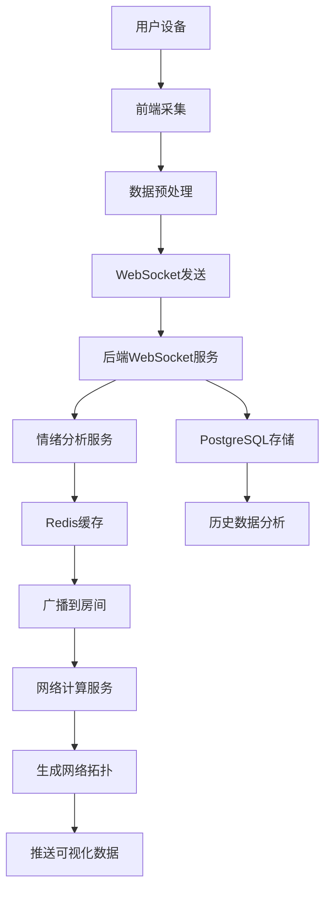

# 产品需求文档 (PRD)
## 方案五：织梦 · 情绪网络

---

## 📋 文档信息

| 项目 | 内容 |
|------|------|
| **产品名称** | 织梦 · 情绪网络 |
| **版本号** | v1.0 |
| **创建日期** | 2025-10-30 |
| **产品负责人** | [待定] |
| **技术负责人** | [待定] |
| **文档类型** | 产品需求文档 (PRD) |

---

## 🎯 1. 产品概述

### 1.1 产品定义

**织梦·情绪网络** 是全球首个基于集体情绪的沉浸式社交恐怖体验平台。通过先进的多模态情绪识别技术，实时采集4名玩家的情绪状态，并将其编织成动态的"情绪网络"可视化。恐怖事件基于集体情绪状态动态生成，每个人的情绪都会实时影响其他人的体验，创造前所未有的"情绪共振"社交连接。

### 1.2 产品愿景

重新定义人类社交方式，让情绪成为连接心灵的桥梁；让恐惧不再是障碍，而是促进深度社交的催化剂；构建基于情绪共鸣的新型人际关系网络。

### 1.3 核心价值主张

- **情绪可视化**：将抽象情绪转化为震撼的视觉艺术
- **集体共振**：一人情绪波动，全网情绪响应
- **情绪救赎**：通过集体协作将恐惧转化为温暖
- **新型社交**：从游戏伙伴到灵魂伴侣的深度连接

---

## 🎯 2. 产品定位与目标

### 2.1 市场定位

面向18-35岁社交恐惧人群和新时代社交探索者的创新社交平台，融合恐怖体验、情绪疗愈与社交连接于一体。

### 2.2 产品目标

#### 2.2.1 商业目标
- **短期目标（3个月）**：完成MVP开发，获得500个体验小组（2000名用户）
- **中期目标（6个月）**：累计10,000名用户，日活跃小组数达到500个
- **长期目标（12个月）**：成为情绪社交领域的独角兽企业，获得B轮融资

#### 2.2.2 用户目标
- 帮助社恐人群突破社交障碍，建立深度连接
- 提供安全的环境让用户探索和表达真实情绪
- 通过集体情绪体验培养情绪感知和管理能力
- 创造超越普通友谊的"情绪纽带"关系

#### 2.2.3 技术目标
- 实时情绪识别延迟 < 500ms
- 4人情绪网络同步延迟 < 100ms
- 集体情绪触发准确率 ≥ 90%
- 系统并发支持 1000+ 个情绪网络房间

---

## 👥 3. 用户画像

### 3.1 主要用户群体

#### 3.1.1 社交恐惧者（核心用户，40%）

**用户特征**：
- 年龄：20-30岁
- 性格内向，不擅长传统社交
- 内心渴望深度连接，但缺乏突破口
- 对新科技接受度高，愿意尝试新颖社交方式

**使用场景**：
- 想要突破社交圈但害怕直接社交
- 寻求情感支持和理解
- 希望在不尴尬的环境中与陌生人交流
- 压力大时寻找情绪出口

**典型需求**：
- "我想交朋友，但不知道该怎么开始对话"
- "我害怕社交冷场，这里可以用情绪代替语言"
- "我想被理解，但不用直接说出内心想法"

#### 3.1.2 情感探索者（次要用户，35%）

**用户特征**：
- 年龄：18-28岁
- 好奇心强，热爱尝试新体验
- 追求独特、新颖的社交方式
- 认同情绪表达和心理健康的重要性

**使用场景**：
- 寻找创新社交体验
- 追求情绪共鸣和精神连接
- 愿意分享和感知他人情绪
- 对科技与情感结合感兴趣

**典型需求**：
- "普通的社交太无聊了，我想要更深层的连接"
- "看到别人的情绪状态很有意思"
- "我想体验情绪共振的感觉"

#### 3.1.3 心理健康关注者（潜在用户，25%）

**用户特征**：
- 年龄：25-35岁
- 关注心理健康，有情绪管理需求
- 可能正在接受心理咨询或治疗
- 愿意为心理健康投资

**使用场景**：
- 学习情绪管理技巧
- 在安全环境中探索情绪
- 寻求情绪支持和建议
- 与专业人士合作使用

**典型需求**：
- "我想更好地理解和管理自己的情绪"
- "我想学会共情他人"
- "这里可以安全地表达负面情绪"

### 3.2 用户旅程地图

```
认知 → 兴趣 → 尝试 → 体验 → 留存 → 传播
  ↓       ↓      ↓      ↓      ↓      ↓
了解   →  观看  → 注册 → 首次  → 常规  → 分享
产品   →  Demo  → 体验  → 情绪  → 使用  → 推荐
  |       |      |      |      |      |
困惑   →  好奇  → 紧张  → 震撼  → 依赖  → 热爱
```

### 3.3 关键使用场景

#### 3.3.1 深夜情感陪伴（22:00-02:00）

**场景描述**：
夜深人静时，用户独自在家，感到孤独和焦虑。通过平台加入一个情绪网络房间，与其他3名陌生人共同经历情绪体验。

**情绪状态**：
- 初始：孤独、焦虑、空虚
- 过程：好奇、紧张、共鸣、温暖
- 结果：被理解、连接感、内心平静

#### 3.3.2 朋友聚会创新体验（周末下午）

**场景描述**：
4个好友相约体验新型社交游戏，共同探索情绪网络的新奇体验。

**情绪状态**：
- 初始：兴奋、期待
- 过程：紧张、刺激、狂欢
- 结果：关系升华、美好回忆、持续联系

#### 3.3.3 心理疗愈辅助（预约制）

**场景描述**：
在心理咨询师建议下，患者参与情绪网络体验，作为传统治疗的情绪辅助手段。

**情绪状态**：
- 初始：抵触、紧张
- 过程：探索、接纳
- 结果：情绪释放、自我认知、疗愈

---

## ⚙️ 4. 功能需求

### 4.1 核心功能模块

#### 4.1.1 情绪采集模块

**功能描述**：实时采集4名用户的情绪数据，包括面部表情、心率、语音、皮肤电反应等多维度指标。

**功能点**：

**A. 多模态情绪识别**
- **面部表情识别**
  - 摄像头实时捕获720p视频流
  - 识别7种基础情绪：恐惧、焦虑、平静、兴奋、好奇、困惑、专注
  - 情绪强度分级（0-100分）
  - 微表情检测：捕捉瞬间情绪波动
  - 识别准确率 ≥ 85%

- **心率检测与分析**
  - 通过摄像头PPG技术检测心率
  - 心率变异性分析（HRV）
  - 基于生理指标判断压力水平
  - 压力指数计算（0-100）
  - 采样频率：30fps

- **语音情绪分析**
  - 麦克风实时采集16kHz音频
  - 分析音调、语速、颤动、能量
  - 识别语音中的情绪状态
  - 呼吸节奏检测（紧张/放松）
  - 支持中英文语音识别

- **皮肤电反应（GSR）**
  - 通过可穿戴设备或手机传感器检测
  - 反映交感神经兴奋度
  - 情绪唤醒水平评估
  - 数据采样：10Hz

**B. 情绪数据融合**
```javascript
// 情绪数据结构示例
{
  "user_id": "uuid",
  "timestamp": "2025-10-30T12:00:00.000Z",
  "emotion_scores": {
    "fear": 75,
    "anxiety": 60,
    "calm": 20,
    "excitement": 45,
    "curiosity": 30,
    "confusion": 15,
    "focus": 50
  },
  "physiology": {
    "heart_rate": 95,
    "hrv_score": 0.65,
    "voice_tremor": 0.3,
    "skin_conductance": 0.8,
    "breathing_rate": 18  // 每分钟呼吸次数
  },
  "confidence": 0.87,
  "data_quality": {
    "face_detected": true,
    "audio_clear": true,
    "signal_strength": 0.92
  }
}
```

#### 4.1.2 情绪网络可视化模块

**功能描述**：将4名用户的实时情绪状态编织成动态的3D可视化网络，让用户直观看到彼此的情绪流动。

**功能点**：

**A. 网络拓扑构建**
- **节点设计**
  - 每个玩家用3D球体表示
  - 节点大小：代表在该玩家身上花费的注意力
  - 节点颜色：根据主导情绪变化
    - 恐惧：深红色 (#E74C3C)
    - 焦虑：橙色 (#F39C12)
    - 平静：深蓝色 (#3498DB)
    - 兴奋：金黄色 (#F1C40F)
    - 好奇：紫色 (#9B59B6)
    - 困惑：灰蓝色 (#95A5A6)
    - 专注：翠绿色 (#1ABC9C)
  - 节点亮度：情绪强度（0-100）

- **连线设计**
  - 连线粗细：情绪传播强度
  - 连线颜色：主导情绪的过渡色
  - 连线脉动：情绪波动频率
  - 连线数量：根据情感连接数量动态变化

- **3D网络特性**
  - 网络整体位置：代表集体情绪中心
  - 网络波动幅度：代表情绪共鸣强度
  - 网络旋转速度：代表情绪变化速度
  - 网络粒子效果：情绪能量可视化

**B. 实时渲染引擎**
```javascript
// Three.js渲染配置
const networkScene = {
  nodes: [
    {
      id: 'user_1',
      position: { x: 0, y: 0, z: 0 },
      emotion: 'fear',
      intensity: 75,
      size: 1.2,
      color: '#E74C3C',
      glowIntensity: 0.8
    }
    // ... 其他3个节点
  ],
  edges: [
    {
      source: 'user_1',
      target: 'user_2',
      strength: 0.6,
      emotion: 'anxiety',
      pulseRate: 2.5
    }
    // ... 连线
  ],
  globalState: {
    centerEmotion: 'fear',
    collectiveIntensity: 68,
    resonanceLevel: 0.72,
    atmosphere: 'storm' // calm, storm, chaos, harmony
  }
};
```

#### 4.1.3 集体情绪触发机制

**功能描述**：根据集体情绪状态自动生成相应的体验内容，触发集体事件和情绪场景。

**功能点**：

**A. 情绪状态判断算法**
- **集体恐惧风暴**
  - 触发条件：3人以上恐惧值 ≥ 80
  - 响应时间：< 2秒
  - 生成内容：
    - 恐怖场景：废弃医院、古堡地下室、荒山野岭
    - 音效：低频轰鸣、心跳声、脚步声
    - 光效：红色闪烁、阴影游走
    - 互动：集体惊吓、协作逃生

- **集体兴奋狂欢**
  - 触发条件：2人以上兴奋值 ≥ 80
  - 响应时间：< 2秒
  - 生成内容：
    - 狂欢场景：星空舞台、音乐节、灯光秀
    - 音效：欢快音乐、笑声、欢呼声
    - 光效：彩色光柱、烟花、极光
    - 互动：集体舞蹈、情绪合唱

- **集体平静冥想**
  - 触发条件：3人以上平静值 ≥ 60
  - 响应时间：< 3秒
  - 生成内容：
    - 冥想场景：森林空地、海边日落、山顶云海
    - 音效：自然声、白噪音、冥想音乐
    - 光效：柔和暖光、缓慢渐变
    - 互动：同步呼吸、情绪共鸣

**B. 动态内容生成系统**
```python
# 集体情绪触发逻辑
class CollectiveEmotionTrigger:
    def __init__(self):
        self.trigger_conditions = {
            'collective_fear': {
                'threshold': 80,
                'participants_required': 3,
                'duration': 10  # 秒
            },
            'collective_excitement': {
                'threshold': 80,
                'participants_required': 2,
                'duration': 15
            },
            'collective_calm': {
                'threshold': 60,
                'participants_required': 3,
                'duration': 20
            },
            'chaos': {
                'threshold': 70,
                'participants_required': 2,
                'duration': 12
            },
            'harmony': {
                'threshold': 50,
                'participants_required': 4,
                'duration': 30
            }
        }

    def evaluate_emotion_state(self, emotion_data):
        """评估集体情绪状态并触发相应内容"""
        for emotion, scores in emotion_data.items():
            participants = len(scores)
            if participants >= self.trigger_conditions[emotion]['participants_required']:
                avg_score = sum(scores.values()) / participants
                if avg_score >= self.trigger_conditions[emotion]['threshold']:
                    return self.generate_content(emotion, avg_score)
        return None
```

#### 4.1.4 情绪救赎任务系统

**功能描述**：当集体情绪陷入极端状态时，触发特殊的协作任务，引导玩家通过集体努力将负面情绪转化为积极情绪。

**功能点**：

**A. 任务生成机制**
- **红色风暴任务**（集体恐惧）
  - 任务描述：
    ```
    任务：净化恐惧风暴
    当前状态：网络中出现强烈的红色能量风暴
    任务目标：将恐惧转化为勇气和温暖
    角色分配：
    - 守护者（冷静）：保持内心平静，散发蓝色能量
    - 引导者（希望）：传递正能量，散发金色光芒
    - 治愈者（关怀）：引导深呼吸，散发绿色波纹
    - 拥抱者（温暖）：主动连接他人，散发白色光晕
    完成条件：4个角色各司其职，持续60秒
    成功奖励：恐惧转化为绚烂的彩虹光芒
    ```
  - 技术实现：
    - 每个角色有独特的3D视觉特效
    - 任务进度条实时显示
    - 集体努力达到阈值时触发转化动画

- **混沌漩涡任务**（情绪混乱）
  - 任务描述：
    ```
    任务：编织情绪丝带
    当前状态：网络中出现混乱的情绪漩涡
    任务目标：将杂乱的能量梳理成美丽的丝带
    角色分配：
    - 编织者A：专注红色（恐惧）
    - 编织者B：专注橙色（焦虑）
    - 编织者C：专注蓝色（平静）
    - 编织者D：专注黄色（兴奋）
    完成条件：4人协作，将所有情绪编织成统一丝带
    成功奖励：情绪丝带升华为美丽的彩虹桥
    ```

**B. 协作机制设计**
```javascript
// 情绪救赎任务数据结构
const redemptionTask = {
  task_id: "redemption_001",
  task_type: "collective_fear",
  title: "净化恐惧风暴",
  description: "通过集体努力将恐惧转化为勇气",
  required_roles: [
    {
      role: "guardian",
      description: "保持冷静，散发蓝色能量",
      emotion_required: "calm",
      intensity_required: 70,
      visual_effect: "blue_aura"
    },
    {
      role: "guide",
      description: "传递希望，散发金色光芒",
      emotion_required: "hope",
      intensity_required: 60,
      visual_effect: "golden_light"
    },
    {
      role: "healer",
      description: "引导呼吸，散发绿色波纹",
      emotion_required: "peace",
      intensity_required: 50,
      visual_effect: "green_waves"
    },
    {
      role: "embracer",
      description: "主动连接，散发白色光晕",
      emotion_required: "love",
      intensity_required: 40,
      visual_effect: "white_glow"
    }
  ],
  duration: 60, // 秒
  success_threshold: 0.8,
  failure_threshold: 0.3,
  rewards: {
    visual: "rainbow_transformation",
    emotional: "collective_warmth",
    social: "bond_strengthen"
  }
};
```

#### 4.1.5 社交连接系统

**功能描述**：基于情绪网络体验，建立用户之间的深层社交连接，发展为长期关系。

**功能点**：

**A. 情绪匹配算法**
- **兼容性评分**
  - 情绪共振度：0.8以上为高匹配
  - 情绪互补性：恐惧+平静=最佳组合
  - 情绪成长性：彼此促进情绪改善
  - 社交舒适度：互动自然流畅

- **推荐系统**
```python
class EmotionMatchAlgorithm:
    def __init__(self):
        self.compatibility_weights = {
            'resonance': 0.4,      # 情绪共振
            'complement': 0.3,     # 情绪互补
            'growth': 0.2,         # 成长促进
            'comfort': 0.1         # 舒适度
        }

    def calculate_compatibility(self, user1_emotions, user2_emotions):
        """计算两个用户的情绪兼容性"""
        resonance = self.calculate_resonance(user1_emotions, user2_emotions)
        complement = self.calculate_complement(user1_emotions, user2_emotions)
        growth = self.calculate_growth_potential(user1_emotions, user2_emotions)
        comfort = self.calculate_comfort_level(user1_emotions, user2_emotions)

        score = (resonance * self.compatibility_weights['resonance'] +
                 complement * self.compatibility_weights['complement'] +
                 growth * self.compatibility_weights['growth'] +
                 comfort * self.compatibility_weights['comfort'])

        return min(score, 1.0)  # 最高分1.0
```

**B. 关系进化系统**
- **阶段1：情绪共鸣者**（初次体验后）
  - 识别：共同经历了强烈情绪波动
  - 特征：彼此记住对方的情绪模式
  - 互动：可以查看对方的基本情绪档案

- **阶段2：情绪伙伴**（体验3次后）
  - 识别：情绪网络中有稳定的连接
  - 特征：可以互相发送情绪关怀
  - 互动：可以邀请对方一起体验

- **阶段3：情绪挚友**（体验10次后）
  - 识别：深度情绪理解和支持
  - 特征：互相了解情绪触发因素
  - 互动：可以进行私人情绪对话

- **阶段4：灵魂伴侣**（体验20次后）
  - 识别：最高级别的情绪共鸣
  - 特征：情绪状态实时同步
  - 互动：可以创建专属情绪网络

#### 4.1.6 内容生成模块

**功能描述**：基于集体情绪状态，AI实时生成个性化的视觉、听觉和交互内容。

**功能点**：

**A. 视觉内容生成**
- **情绪化场景生成**
  - 恐怖场景：废弃医院、古堡、地下室、荒山、鬼屋
  - 平静场景：森林、海边、山顶、花园、湖泊
  - 兴奋场景：舞台、游乐园、音乐厅、节庆广场
  - 好奇场景：图书馆、实验室、博物馆、星空

- **动态特效系统**
  - 粒子效果：情绪能量可视化
  - 光影效果：情绪氛围渲染
  - 3D模型：情绪化身形态
  - 粒子动画：情绪流动效果

**B. 听觉内容生成**
- **情绪适配音效**
  - 恐怖：低频轰鸣、心跳、尖叫、风声
  - 平静：自然声、白噪音、冥想音乐、流水声
  - 兴奋：欢快音乐、笑声、欢呼、节拍
  - 好奇：探索音效、提示音、神秘旋律

**C. AI生成内容示例**
```python
class EmotionContentGenerator:
    def __init__(self):
        self.gpt_client = OpenAI()
        self.stable_diffusion = StableDiffusionAPI()

    def generate_scene_description(self, emotion_state):
        """根据情绪状态生成场景描述"""
        prompt = f"""
        基于以下集体情绪状态，生成一个沉浸式场景描述：
        集体主导情绪：{emotion_state['dominant_emotion']}
        平均强度：{emotion_state['average_intensity']}
        参与人数：{emotion_state['participant_count']}
        情绪氛围：{emotion_state['atmosphere']}

        要求：
        1. 描述要生动、具体、具有沉浸感
        2. 融入情绪美学元素
        3. 适合4人集体体验
        4. 包含视觉、听觉、触觉细节
        """
        return self.gpt_client.generate(prompt)

    def generate_visual_scene(self, description):
        """生成视觉场景"""
        image_prompt = f"""
        {description}, 3D渲染, 电影级画质, 情绪美学,
        高动态范围, 戏剧性光影, 神秘氛围
        """
        return self.stable_diffusion.generate(image_prompt)
```

### 4.2 辅助功能模块

#### 4.2.1 用户档案系统

**功能点**：
- **情绪档案**
  - 情绪历史记录（加密存储）
  - 情绪模式分析
  - 情绪成长轨迹
  - 触发因素识别
  - 改善进度追踪

- **社交档案**
  - 情绪伙伴关系网络
  - 互动记录和评分
  - 兼容性分析报告
  - 社交成长建议

- **偏好设置**
  - 体验偏好选择
  - 内容过滤设置
  - 隐私控制选项
  - 通知频率设置

**数据模型**：

```python
class UserProfile(Base):
    __tablename__ = 'user_profiles'

    user_id = Column(UUID, primary_key=True)
    created_at = Column(DateTime, default=func.now())

    # 基础信息
    nickname = Column(String(50))
    age_range = Column(String(20))  # 18-24, 25-30, 31-35, 36+
    gender = Column(String(10))
    location = Column(String(100))

    # 情绪档案
    emotion_baseline = Column(JSONB)
    # 格式: {"fear": 45, "anxiety": 38, "calm": 62, ...}

    emotion_history = Column(JSONB)
    # 格式: [{"timestamp": "...", "session_id": "...", "emotions": {...}}]

    emotional_growth = Column(JSONB)
    # 格式: {"trend": "improving", "confidence_increase": 0.15, "fear_decrease": 0.20}

    # 社交档案
    connections = Column(JSONB)
    # 格式: [{"user_id": "...", "relationship_stage": "emotion_partner", "compatibility": 0.85}]

    social_metrics = Column(JSONB)
    # 格式: {"sessions_attended": 45, "successful_connections": 8, "bond_strength": 0.72}

    # 偏好设置
    preferences = Column(JSONB)
    # 格式: {
    #   "preferred_emotions": ["calm", "curiosity"],
    #   "avoid_emotions": ["extreme_fear"],
    #   "notification_frequency": "weekly",
    #   "privacy_level": 3  # 1-5
    # }

    # 元数据
    total_sessions = Column(Integer, default=0)
    total_duration = Column(Integer, default=0)  # 秒
    last_active = Column(DateTime)
    account_status = Column(String(20), default='active')
```

#### 4.2.2 安全与隐私保护

**功能点**：
- **数据加密**
  - 情绪生物特征数据端到端加密
  - 传输层TLS 1.3加密
  - 存储层AES-256加密
  - 密钥定期轮换

- **隐私控制**
  - 用户可控制情绪数据保留期限
  - 可选择性分享情绪信息
  - 支持数据完全删除
  - 匿名化数据分析选项

- **心理健康安全**
  - 实时监控用户情绪状态
  - 识别极端情绪风险
  - 触发心理健康干预机制
  - 24/7心理支持热线

**隐私策略**：

```python
class PrivacyManager:
    def __init__(self):
        self.encryption_key = self.load_encryption_key()
        self.retention_policy = {
            'emotion_biometrics': 30,  # 天
            'emotion_analysis': 90,
            'connection_history': 365,
            'user_profile': 'indefinite'
        }

    def anonymize_user_data(self, user_id, data):
        """数据匿名化"""
        anonymized = {
            'age_range': data.get('age_range'),
            'general_location': self.generalize_location(data.get('location')),
            'emotion_patterns': self.extract_emotion_patterns(data.get('emotion_history')),
            'connection_type': data.get('connections', {}).get('type')
        }
        return anonymized

    def delete_user_data(self, user_id, data_type=None):
        """选择性或完全删除用户数据"""
        if data_type:
            # 删除特定类型数据
            self.db.delete_data(user_id, data_type)
        else:
            # 完全删除用户数据
            self.db.delete_user(user_id)
            # 通知所有连接用户
            self.notify_connections(user_id, 'user_deleted')
```

---

## 🔧 5. 非功能需求

### 5.1 性能需求

| 指标类型 | 具体要求 | 测量标准 | 优化策略 |
|----------|----------|----------|----------|
| **实时性** | 情绪识别延迟 ≤ 500ms | 95%请求 | GPU加速、模型优化 |
| | 4人网络同步延迟 ≤ 100ms | 99%请求 | WebRTC、P2P传输 |
| | 集体触发响应 ≤ 2秒 | 90%场景 | 预加载、缓存机制 |
| **渲染性能** | 3D渲染帧率 ≥ 60fps | 平均负载 | LOD渲染、实例化 |
| | 粒子效果 ≤ 20% GPU | 峰值负载 | GPU粒子系统 |
| **吞吐量** | 并发房间数 1000+ | 峰值时段 | 微服务架构 |
| | 每房间数据流 ≤ 1Mbps | 标准配置 | 数据压缩、传输优化 |
| **资源占用** | 客户端CPU ≤ 60% | 平均负载 | 多线程、异步处理 |
| | 客户端内存 ≤ 3GB | 峰值负载 | 内存池、垃圾回收 |
| | 服务端内存 ≤ 16GB/节点 | 平均负载 | Redis缓存、连接池 |

### 5.2 可用性需求

- **系统可用性**：99.95%（年度停机时间 ≤ 4.38小时）
- **故障恢复时间**：≤ 15分钟（中等故障）、≤ 30分钟（严重故障）
- **数据备份**：实时同步备份 + 每日全量备份
- **容灾能力**：多地域部署，RPO ≤ 5分钟，RTO ≤ 30分钟
- **降级方案**：
  - 主线路由故障 → 备用路由自动切换
  - 情绪识别服务过载 → 降级到基础模式
  - 可视化渲染卡顿 → 自动降低画质

### 5.3 安全需求

- **数据加密**：
  - 传输层：TLS 1.3 + 证书钉扎
  - 存储层：AES-256 + 密钥分层
  - 应用层：端到端加密（生物特征数据）
- **访问控制**：
  - 基于OAuth 2.0的认证
  - JWT令牌 + 刷新令牌机制
  - API限流：1000次/小时/用户
- **安全审计**：
  - 记录所有敏感操作日志
  - 异常行为实时监控
  - 季度安全渗透测试
- **隐私合规**：
  - 符合《个人信息保护法》
  - 符合GDPR要求
  - 支持用户数据可携权
  - 数据处理透明化

### 5.4 兼容性需求

- **浏览器支持**：
  - Chrome 100+（推荐）
  - Firefox 98+
  - Safari 15.4+
  - Edge 100+
  - 移动端浏览器：Safari iOS 15+、Chrome Android 100+
- **设备要求**：
  - 摄像头：720p以上
  - 麦克风：16kHz采样率
  - 网络：带宽 ≥ 5Mbps，延迟 ≤ 50ms
  - GPU：支持WebGL 2.0
- **操作系统**：
  - Windows 10/11
  - macOS 12+
  - iOS 15+
  - Android 10+

### 5.5 可维护性需求

- **代码质量**：
  - 单元测试覆盖率 ≥ 85%
  - 集成测试覆盖率 ≥ 70%
  - 代码复杂度：Cyclomatic ≤ 10
  - 代码审查：100%覆盖率
- **监控告警**：
  - 关键指标实时监控（Grafana仪表盘）
  - 异常自动告警（邮件/短信/Slack）
  - 性能趋势分析
  - 用户行为分析
- **文档完整性**：
  - API文档（Swagger/OpenAPI）
  - 架构文档（系统图、数据流图）
  - 运维文档（部署手册、故障排查）
  - 用户手册（操作指南、FAQ）

---

## 🏗️ 6. 技术架构

### 6.1 整体架构图

```
┌─────────────────────────────────────────────────────────────────┐
│                           用户层                                 │
│  ┌───────────┐  ┌───────────┐  ┌───────────┐  ┌─────────────┐    │
│  │  Web前端  │  │ 移动App   │  │ VR设备    │  │ 可穿戴设备  │    │
│  │  (4人房间) │  │ (备用)    │  │ (可选)    │  │ (GSR传感器) │    │
│  └───────────┘  └───────────┘  └───────────┘  └─────────────┘    │
└─────────────────────────────────────────────────────────────────┘
                              │
                      WebSocket + WebRTC
                              │
┌─────────────────────────────────────────────────────────────────┐
│                         API网关层                                │
│  ┌─────────────────────────────────────────────────────────────┐ │
│  │        Kong Gateway - 路由、限流、认证、监控                │ │
│  └─────────────────────────────────────────────────────────────┘ │
└─────────────────────────────────────────────────────────────────┘
                              │
┌─────────────────────────────────────────────────────────────────┐
│                        业务服务层                                │
│  ┌──────────────┐ ┌──────────────┐ ┌─────────────────────────────┐ │
│  │ 房间管理服务  │ │ 情绪识别服务  │ │    社交连接服务            │ │
│  │ - 房间创建   │ │ - 多模态采集  │ │    - 关系管理             │ │
│  │ - 状态同步   │ │ - 特征提取   │ │    - 匹配算法             │ │
│  │ - 用户匹配   │ │ - 情绪分类   │ │    - 互动记录             │ │
│  └──────────────┘ └──────────────┘ └─────────────────────────────┘ │
│  ┌──────────────┐ ┌──────────────┐ ┌─────────────────────────────┐ │
│  │ 可视化服务   │ │ 内容生成服务  │ │    任务系统服务            │ │
│  │ - 3D渲染    │ │ - 场景生成   │ │    - 救赎任务              │ │
│  │ - 网络拓扑  │ │ - 音效生成   │ │    - 协作机制              │ │
│  │ - 特效系统  │ │ - AI内容    │ │    - 进度追踪              │ │
│  └──────────────┘ └──────────────┘ └─────────────────────────────┘ │
└─────────────────────────────────────────────────────────────────┘
                              │
┌─────────────────────────────────────────────────────────────────┐
│                         AI/ML服务层                              │
│  ┌──────────────┐ ┌──────────────┐ ┌─────────────────────────────┐ │
│  │ 情绪识别引擎  │ │ GPT-4内容生成 │ │   集体情绪计算引擎         │ │
│  │ - face-api   │ │ - 场景描述   │ │   - 情绪共振算法           │ │
│  │ - TensorFlow │ │ - 故事生成   │ │   - 触发条件判断           │ │
│  │ - 自训练模型 │ │ - 对话生成   │ │   - 预测模型              │ │
│  └──────────────┘ └──────────────┘ └─────────────────────────────┘ │
│  ┌──────────────┐ ┌──────────────┐ ┌─────────────────────────────┐ │
│  │Stable Diffusion│ │ ElevenLabs   │ │   推荐引擎                 │ │
│  │ - 场景渲染   │ │ - 语音合成   │ │   - 协同过滤               │ │
│  │ - 风格转换   │ │ - 情绪化语音 │ │   - 内容推荐               │ │
│  └──────────────┘ └──────────────┘ └─────────────────────────────┘ │
└─────────────────────────────────────────────────────────────────┘
                              │
┌─────────────────────────────────────────────────────────────────┐
│                        数据存储层                                │
│  ┌──────────────┐ ┌──────────────┐ ┌─────────────────────────────┐ │
│  │ PostgreSQL   │ │ Redis Cluster│ │   MongoDB                   │ │
│  │ (主数据库)   │ │ (缓存/会话)   │ │   (文档存储)                │ │
│  │ - 用户档案   │ │ - 实时情绪   │ │   - 情绪历史                │ │
│  │ - 关系数据   │ │ - 房间状态   │ │   - 内容库                  │ │
│  └──────────────┘ └──────────────┘ └─────────────────────────────┘ │
│  ┌──────────────┐ ┌──────────────┐ ┌─────────────────────────────┐ │
│  │  MinIO       │ │ InfluxDB     │ │   Elasticsearch             │ │
│  │ (对象存储)   │ │ (时序数据)    │ │   (日志/搜索)               │ │
│  │ - 视频录制   │ │ - 情绪时序   │ │   - 分析日志                │ │
│  │ - 音频文件   │ │ - 性能指标   │ │   - 用户行为                │ │
│  └──────────────┘ └──────────────┘ └─────────────────────────────┘ │
└─────────────────────────────────────────────────────────────────┘
```

### 6.2 前端架构

#### 6.2.1 Web前端技术栈

**核心技术选型**：

| 技术领域 | 选用方案 | 版本 | 用途 |
|----------|----------|------|------|
| **框架** | React | 18.2+ | UI框架 |
| **状态管理** | Redux Toolkit + RTK Query | 2.0+ | 状态管理、数据获取 |
| **3D渲染** | Three.js + React Three Fiber | r152+ | 3D场景渲染 |
| **图形库** | D3.js + Custom Shader | 7.0+ | 2D数据可视化 |
| **动画** | Framer Motion | 10.0+ | 界面动画 |
| **WebRTC** | Simple-peer + Socket.io-client | 15.0+ | P2P音视频通信 |
| **AI/ML** | TensorFlow.js + face-api.js | 4.11+ | 客户端AI推理 |
| **构建工具** | Vite | 4.0+ | 快速构建 |
| **TypeScript** | TypeScript | 5.0+ | 类型安全 |
| **样式** | Styled-components | 6.0+ | CSS-in-JS |

**项目结构**：

```
frontend/
├── src/
│   ├── components/              # 可复用组件
│   │   ├── EmotionNetwork/      # 情绪网络可视化组件
│   │   │   ├── Network3D.jsx    # 3D网络渲染
│   │   │   ├── EmotionNode.jsx  # 情绪节点
│   │   │   ├── EmotionEdge.jsx  # 情绪连线
│   │   │   ├── ParticleSystem.jsx # 粒子效果
│   │   │   └── index.js
│   │   ├── EmotionCapture/      # 情绪采集组件
│   │   │   ├── CameraCapture.jsx
│   │   │   ├── AudioCapture.jsx
│   │   │   ├── EmotionDetector.jsx
│   │   │   └── index.js
│   │   ├── ExperienceRoom/      # 体验房间组件
│   │   │   ├── RoomLayout.jsx
│   │   │   ├── Participants.jsx
│   │   │   ├── EmotionDashboard.jsx
│   │   │   └── index.js
│   │   ├── RedemptionTask/      # 救赎任务组件
│   │   │   ├── TaskPanel.jsx
│   │   │   ├── RoleAssignment.jsx
│   │   │   ├── ProgressBar.jsx
│   │   │   └── index.js
│   │   └── Shared/              # 共享组件
│   │       ├── Button.jsx
│   │       ├── Modal.jsx
│   │       ├── Toast.jsx
│   │       └── index.js
│   ├── pages/                  # 页面组件
│   │   ├── Home/
│   │   ├── Room/
│   │   ├── Profile/
│   │   └── History/
│   ├── hooks/                  # 自定义Hook
│   │   ├── useEmotionCapture.js
│   │   ├── useWebRTC.js
│   │   ├── useEmotionNetwork.js
│   │   └── useRedemptionTask.js
│   ├── store/                  # Redux状态
│   │   ├── slices/
│   │   │   ├── emotionSlice.js
│   │   │   ├── roomSlice.js
│   │   │   ├── networkSlice.js
│   │   │   └── userSlice.js
│   │   └── index.js
│   ├── services/               # API服务
│   │   ├── emotionService.js
│   │   ├── roomService.js
│   │   ├── socialService.js
│   │   └── websocketService.js
│   ├── utils/                  # 工具函数
│   │   ├── emotionAnalysis.js
│   │   ├── networkTopology.js
│   │   └── dataProcessing.js
│   ├── shaders/                # WebGL着色器
│   │   ├── emotionParticle.vert
│   │   ├── emotionParticle.frag
│   │   ├── emotionGlow.vert
│   │   └── emotionGlow.frag
│   ├── styles/                 # 样式文件
│   │   ├── theme.js
│   │   ├── globalStyle.js
│   │   └── components/
│   ├── types/                  # TypeScript类型定义
│   │   ├── emotion.types.js
│   │   ├── network.types.js
│   │   └── user.types.js
│   └── App.jsx
├── public/
│   ├── models/                 # 3D模型
│   ├── textures/               # 纹理贴图
│   ├── shaders/                # 预编译着色器
│   └── icons/
├── tests/                      # 测试文件
├── package.json
└── vite.config.js
```

#### 6.2.2 情绪网络3D可视化实现

**核心技术方案**：

```javascript
// EmotionNetwork3D.jsx - 主组件
import React, { useRef, useMemo } from 'react';
import { Canvas, useFrame } from '@react-three/fiber';
import { OrbitControls, EffectComposer, Bloom } from '@react-three/drei';
import * as THREE from 'three';

const EmotionNetwork = ({ emotionData, participants }) => {
  return (
    <Canvas camera={{ position: [0, 0, 10], fov: 75 }}>
      {/* 环境设置 */}
      <color attach="background" args={['#0a0a0a']} />
      <ambientLight intensity={0.3} />
      <pointLight position={[10, 10, 10]} intensity={0.8} />

      {/* 粒子效果背景 */}
      <EmotionParticles />

      {/* 情绪网络主体 */}
      <NetworkNodes emotionData={emotionData} participants={participants} />
      <NetworkEdges emotionData={emotionData} participants={participants} />

      {/* 后处理效果 */}
      <EffectComposer>
        <Bloom intensity={1.5} luminanceThreshold={0.9} />
      </EffectComposer>

      {/* 相机控制 */}
      <OrbitControls enablePan={false} enableZoom={true} enableRotate={true} />
    </Canvas>
  );
};

// 情绪节点组件
const NetworkNodes = ({ emotionData, participants }) => {
  return participants.map((participant, index) => (
    <EmotionNode
      key={participant.user_id}
      position={calculateNodePosition(index, participants.length)}
      emotion={participant.dominant_emotion}
      intensity={participant.emotion_intensity}
      userId={participant.user_id}
    />
  ));
};

// 情绪节点实现
const EmotionNode = ({ position, emotion, intensity, userId }) => {
  const meshRef = useRef();
  const glowRef = useRef();

  // 情绪颜色映射
  const emotionColors = {
    fear: new THREE.Color('#E74C3C'),
    anxiety: new THREE.Color('#F39C12'),
    calm: new THREE.Color('#3498DB'),
    excitement: new THREE.Color('#F1C40F'),
    curiosity: new THREE.Color('#9B59B6'),
    confusion: new THREE.Color('#95A5A6'),
    focus: new THREE.Color('#1ABC9C')
  };

  // 实时更新节点属性
  useFrame((state) => {
    if (meshRef.current) {
      // 根据情绪强度调整大小
      const scale = 1 + (intensity / 100) * 0.5;
      meshRef.current.scale.set(scale, scale, scale);

      // 情绪强度决定发光强度
      const glowIntensity = (intensity / 100) * 2;
      meshRef.current.material.emissiveIntensity = glowIntensity;

      // 旋转动画
      meshRef.current.rotation.x += 0.005;
      meshRef.current.rotation.y += 0.01;
    }

    if (glowRef.current) {
      // 发光效果脉动
      const pulse = Math.sin(state.clock.elapsedTime * 3) * 0.5 + 0.5;
      glowRef.current.scale.setScalar(1.2 + pulse * 0.3);
    }
  });

  return (
    <group position={position}>
      {/* 主节点球体 */}
      <mesh ref={meshRef}>
        <sphereGeometry args={[0.5, 32, 32]} />
        <meshStandardMaterial
          color={emotionColors[emotion]}
          emissive={emotionColors[emotion]}
          emissiveIntensity={intensity / 100}
          roughness={0.3}
          metalness={0.7}
        />
      </mesh>

      {/* 发光外晕 */}
      <mesh ref={glowRef}>
        <sphereGeometry args={[0.8, 16, 16]} />
        <meshBasicMaterial
          color={emotionColors[emotion]}
          transparent
          opacity={0.3}
          side={THREE.BackSide}
        />
      </mesh>

      {/* 用户标签 */}
      <UserLabel userId={userId} emotion={emotion} />
    </group>
  );
};

// 情绪连线组件
const NetworkEdges = ({ emotionData, participants }) => {
  const edges = useMemo(() => {
    const connections = [];
    for (let i = 0; i < participants.length; i++) {
      for (let j = i + 1; j < participants.length; j++) {
        connections.push({
          source: participants[i],
          target: participants[j],
          emotion: calculateConnectionEmotion(participants[i], participants[j]),
          strength: calculateConnectionStrength(participants[i], participants[j])
        });
      }
    }
    return connections;
  }, [emotionData, participants]);

  return edges.map((edge, index) => (
    <EmotionEdge
      key={index}
      sourcePosition={calculateNodePosition(
        participants.indexOf(edge.source),
        participants.length
      )}
      targetPosition={calculateNodePosition(
        participants.indexOf(edge.target),
        participants.length
      )}
      emotion={edge.emotion}
      strength={edge.strength}
    />
  ));
};

// 情绪连线实现
const EmotionEdge = ({ sourcePosition, targetPosition, emotion, strength }) => {
  const lineRef = useRef();

  useFrame((state) => {
    if (lineRef.current) {
      // 脉动效果
      const material = lineRef.current.material;
      material.opacity = 0.3 + Math.sin(state.clock.elapsedTime * 4) * 0.2;
      material.linewidth = 2 + strength * 3;
    }
  });

  // 创建贝塞尔曲线
  const curve = useMemo(() => {
    const start = new THREE.Vector3(...sourcePosition);
    const end = new THREE.Vector3(...targetPosition);
    const mid = start.clone().lerp(end, 0.5);
    mid.y += 2; // 添加弧度
    return new THREE.QuadraticBezierCurve3(start, mid, end);
  }, [sourcePosition, targetPosition]);

  return (
    <mesh>
      <tubeGeometry args={[curve, 20, 0.1, 8, false]} />
      <meshBasicMaterial
        ref={lineRef}
        color={getEmotionColor(emotion)}
        transparent
        opacity={0.5}
        blending={THREE.AdditiveBlending}
      />
    </mesh>
  );
};

export default EmotionNetwork;
```

---

## 📊 9. 数据流设计

### 9.1 情绪数据采集流



### 9.2 实时数据同步

```python
# websockets.py
import json
import asyncio
from fastapi import WebSocket, WebSocketDisconnect
from typing import Dict, List

class EmotionDataSync:
    def __init__(self):
        self.room_connections: Dict[str, List[WebSocket]] = {}
        self.user_emotions: Dict[str, Dict] = {}

    async def handle_emotion_data(self, room_id: str, user_id: str, emotion_data: Dict):
        """处理情绪数据并同步"""
        # 1. 更新用户情绪缓存
        self.user_emotions[user_id] = emotion_data

        # 2. 获取房间内所有用户情绪
        room_emotions = {uid: data for uid, data in self.user_emotions.items()
                        if self.get_user_room(uid) == room_id}

        # 3. 计算情绪网络
        network_data = await self.calculate_emotion_network(room_emotions)

        # 4. 广播给房间所有用户
        await self.broadcast_to_room(room_id, {
            'type': 'emotion_network_update',
            'network': network_data
        })

        # 5. 检查集体事件触发
        await self.check_collective_events(room_id, network_data)

    async def calculate_emotion_network(self, emotions: Dict[str, Dict]) -> Dict:
        """计算情绪网络拓扑"""
        # 调用网络计算引擎
        network_engine = EmotionNetworkEngine()
        nodes = [
            EmotionNode(
                user_id=user_id,
                emotions=data['emotions'],
                position={'x': 0, 'y': 0, 'z': 0},
                intensity=data.get('intensity', 50),
                timestamp=data['timestamp']
            )
            for user_id, data in emotions.items()
        ]
        return network_engine.calculate_network_topology(nodes)
```

### 9.3 数据存储架构

**分层存储策略**：

| 数据类型 | 存储方案 | 保留期限 | 使用场景 |
|----------|----------|----------|----------|
| **实时情绪数据** | Redis Cluster | 5分钟 | 实时网络计算、广播 |
| **房间状态** | Redis | 30秒 | 状态同步、用户匹配 |
| **用户档案** | PostgreSQL | 永久 | 长期存储、关系管理 |
| **情绪历史** | MongoDB | 3年 | 历史分析、趋势追踪 |
| **网络记录** | InfluxDB | 1年 | 时序分析、性能监控 |
| **日志数据** | Elasticsearch | 6个月 | 问题排查、行为分析 |
| **媒体文件** | MinIO | 1年 | 录制回放、分享 |

---

## 📅 10. 项目规划

### 10.1 开发阶段规划

#### 10.1.1 总体时间规划

| 阶段 | 时间周期 | 主要任务 | 交付物 |
|------|----------|----------|--------|
| **需求分析与设计** | 3周 | 需求确认、技术调研、架构设计、UI设计 | 完整PRD、技术方案、设计稿 |
| **MVP开发** | 10周 | 核心功能开发、基础UI实现 | 可运行MVP |
| **Alpha测试** | 2周 | 内部测试、Bug修复、性能优化 | Alpha版本 |
| **Beta开发** | 4周 | 完善功能、优化体验、集成测试 | Beta版本 |
| **Beta测试** | 2周 | 外部测试、用户反馈、迭代优化 | 正式版本 |
| **上线发布** | 1周 | 生产部署、监控配置、运营准备 | 线上产品 |

**总周期：22周（约5.5个月）**

#### 10.1.2 MVP阶段详细规划

**第1-3周：需求与设计**
- 用户访谈与需求验证
- 技术选型与架构设计
- 原型设计与评审
- 开发环境搭建

**第4-5周：情绪采集模块**
- 摄像头/麦克风集成
- face-api.js集成
- 基础情绪识别功能
- 简单UI实现

**第6-7周：情绪网络可视化**
- Three.js 3D渲染引擎
- 情绪网络拓扑算法
- 实时可视化渲染
- 性能优化

**第8-9周：实时同步系统**
- WebSocket架构
- 多人房间管理
- 情绪数据同步
- 网络延迟优化

**第10-11周：集体事件系统**
- 集体情绪判断算法
- 事件触发机制
- 救赎任务系统
- 角色分配逻辑

**第12-13周：社交连接系统**
- 兼容性评分算法
- 关系管理模块
- 匹配推荐引擎
- 互动记录系统

### 10.2 资源分配

#### 10.2.1 团队配置

**核心团队（8人）**：

| 角色 | 人数 | 职责 | 技能要求 |
|------|------|------|----------|
| **产品经理** | 1 | 需求管理、项目推进、用户调研 | 产品设计、用户研究、项目管理 |
| **前端开发** | 3 | Web前端开发、3D可视化、UI实现 | React、Three.js、TypeScript |
| **后端开发** | 2 | API开发、数据处理、实时通信 | Python、FastAPI、WebSocket |
| **AI工程师** | 1 | 情绪识别模型、AI集成、算法优化 | 深度学习、PyTorch、OpenCV |
| **算法工程师** | 1 | 网络拓扑算法、情绪传播模型 | 数学建模、图算法、机器学习 |

**扩展团队（可选）**：

| 角色 | 人数 | 职责 |
|------|------|------|
| UI/UX设计师 | 1 | 界面设计、交互设计、视觉规范 |
| 测试工程师 | 1 | 功能测试、性能测试、自动化测试 |
| 运维工程师 | 1 | 部署配置、监控告警、性能优化 |
| 数据工程师 | 1 | 数据建模、数据分析、数据管道 |

#### 10.2.2 预算估算

| 成本类型 | 项目 | 预算（人民币） |
|----------|------|----------------|
| **人员成本** | 核心团队8人 × 5.5月 × 2.5万/月 | 110万 |
| **云服务** | 服务器、数据库、存储、CDN | 5万/月 × 7月 = 35万 |
| **第三方API** | GPT-4、ElevenLabs、云计算资源 | 15万 |
| **AI训练** | GPU算力、数据标注 | 20万 |
| **软件许可** | 开发工具、设计软件、监控工具 | 5万 |
| **硬件设备** | 测试设备、摄像头、麦克风、VR设备 | 10万 |
| **市场推广** | 运营、推广、用户获取 | 15万 |
| **其他** | 办公费用、出差、培训、法务 | 5万 |
| **总计** | | **215万** |

### 10.3 风险评估与应对

#### 10.3.1 技术风险

| 风险项 | 影响程度 | 发生概率 | 应对策略 |
|--------|----------|----------|----------|
| **实时同步性能瓶颈** | 高 | 中 | 1. P2P传输优化<br>2. 边缘计算加速<br>3. 分级降级方案 |
| **3D渲染性能不足** | 中 | 中 | 1. WebGL优化<br>2. LOD渲染<br>3. GPU加速 |
| **情绪识别准确率不达标** | 高 | 中 | 1. 多模型融合<br>2. 个性化训练<br>3. 人工标注数据 |
| **集体情绪计算复杂度** | 中 | 低 | 1. 算法预研<br>2. 简化模型<br>3. 分布式计算 |
| **WebRTC稳定性问题** | 中 | 中 | 1. 多fallback方案<br>2. 错误处理增强<br>3. 断线重连机制 |

#### 10.3.2 产品风险

| 风险项 | 影响程度 | 发生概率 | 应对策略 |
|--------|----------|----------|----------|
| **用户接受度低** | 高 | 中 | 1. 充分用户调研<br>2. 迭代式产品设计<br>3. 用户教育 |
| **情绪数据隐私担忧** | 高 | 中 | 1. 透明隐私政策<br>2. 端到端加密<br>3. 用户完全控制 |
| **心理健康风险** | 高 | 低 | 1. 专业心理师审查<br>2. 风险预警机制<br>3. 紧急干预流程 |
| **竞品快速跟进** | 中 | 高 | 1. 核心算法专利<br>2. 数据壁垒建设<br>3. 用户粘性培养 |

### 10.4 质量保证计划

#### 10.4.1 测试策略

**测试金字塔**：

```
                    /\
                   /  \
                  / E2E \
                 /______\
                /        \
               / Unit+Int \
              /____________\
```

1. **单元测试**（占比70%）
   - 测试覆盖率 ≥ 85%
   - 核心算法100%覆盖
   - 持续集成自动运行

2. **集成测试**（占比20%）
   - API接口测试
   - 数据库集成测试
   - WebSocket实时通信测试
   - 第三方服务Mock测试

3. **端到端测试**（占比10%）
   - 完整用户流程测试
   - 4人房间体验测试
   - 情绪网络可视化测试
   - 自动化UI测试

#### 10.4.2 性能测试

**测试场景**：

| 场景 | 并发用户 | 预期指标 |
|------|----------|----------|
| **正常使用** | 100房间(400人) | 响应时间 < 500ms |
| **高峰使用** | 500房间(2000人) | 响应时间 < 1秒 |
| **压力测试** | 1000房间(4000人) | 系统不崩溃 |
| **长期稳定** | 200房间(800人) | 7×24小时运行 |

**监控指标**：
- 情绪识别延迟
- 网络同步延迟
- 3D渲染帧率
- WebSocket连接稳定性
- CPU/GPU/内存使用率

---

## 📈 11. 成功指标

### 11.1 产品指标 (Product Metrics)

#### 11.1.1 核心业务指标

| 指标类别 | 指标名称 | 定义 | 目标值 |
|----------|----------|------|--------|
| **用户增长** | 新用户注册数 | 每周新增注册用户 | 1000+ |
| | 用户留存率 | 7日留存率 | ≥ 50% |
| | 用户活跃度 | DAU/MAU | ≥ 35% |
| | 完成率 | 完成完整体验会话 | ≥ 70% |
| **体验质量** | 情绪识别准确率 | AI识别与人工标注一致性 | ≥ 85% |
| | 网络同步延迟 | 4人情绪同步延迟 | ≤ 100ms |
| | 3D渲染性能 | 平均帧率 | ≥ 60fps |
| | 集体事件触发率 | 成功触发集体事件 | ≥ 60% |
| **社交效果** | 社交连接转化率 | 体验后建立连接 | ≥ 40% |
| | 情绪伙伴留存 | 30日后仍活跃 | ≥ 60% |
| | 用户推荐率 | NPS得分 | ≥ 60 |
| | 情绪改善自评 | 用户报告改善比例 | ≥ 75% |

#### 11.1.2 技术指标

| 指标类别 | 指标名称 | 定义 | 目标值 |
|----------|----------|------|--------|
| **性能** | API响应时间 | P95响应时间 | < 500ms |
| | 情绪识别延迟 | 从采集到识别 | < 500ms |
| | 网络同步时间 | 4人数据同步 | < 100ms |
| | 页面加载时间 | 首次内容渲染 | < 2秒 |
| **稳定性** | 系统可用性 | 年度可用性 | ≥ 99.95% |
| | WebSocket稳定性 | 连接成功率 | ≥ 99% |
| | 错误率 | 5xx错误占比 | < 0.1% |
| | 崩溃率 | 客户端崩溃率 | < 0.5% |
| **扩展性** | 并发支持 | 同时在线用户 | 4000+ |
| | 房间并发 | 同时活跃房间 | 1000+ |
| | 数据处理量 | 每秒情绪数据处理 | 10,000条 |

### 11.2 业务指标 (Business Metrics)

#### 11.2.1 收入指标

| 指标 | Q1目标 | Q2目标 | Q3目标 | Q4目标 |
|------|--------|--------|--------|--------|
| **订阅收入** | 0 | 10万 | 30万 | 80万 |
| **企业客户** | 0 | 5家 | 15家 | 30家 |
| **ARPU** | 0 | 80元 | 100元 | 120元 |
| **转化率** | - | 5% | 8% | 12% |
| **月经常性收入** | 0 | 15万 | 50万 | 120万 |

#### 11.2.2 成本指标

| 成本类型 | Q1 | Q2 | Q3 | Q4 |
|----------|----|----|----|----|
| **服务器成本** | 8万 | 12万 | 18万 | 25万 |
| **API调用成本** | 3万 | 5万 | 8万 | 12万 |
| **人员成本** | 20万 | 20万 | 20万 | 20万 |
| **营销成本** | 10万 | 20万 | 35万 | 50万 |
| **总成本** | 41万 | 57万 | 81万 | 107万 |

#### 11.2.3 单位经济模型

| 指标 | 数值 |
|------|------|
| **获客成本 (CAC)** | 120元 |
| **用户生命周期价值 (LTV)** | 360元 |
| **LTV/CAC比率** | 3:1 |
| **回收周期** | 3个月 |
| **毛利率** | 70% |

### 11.3 用户指标 (User Metrics)

#### 11.3.1 用户行为指标

**核心使用流程**：

```
用户注册 → 设备测试 → 情绪采集 → 加入房间 → 网络体验 → 集体事件 → 救赎任务 → 体验完成 → 社交连接
    ↓         ↓         ↓         ↓         ↓         ↓         ↓         ↓         ↓
  100%     85%       80%       75%       70%       60%       50%       45%       40%
```

**功能使用率**：

| 功能 | 使用率 | 使用频次 |
|------|--------|----------|
| 情绪采集 | 95% | 每日3次 |
| 情绪网络可视化 | 90% | 每次体验 |
| 集体事件 | 70% | 每次体验 |
| 救赎任务参与 | 60% | 触发时 |
| 社交连接 | 50% | 体验后 |
| 历史回顾 | 40% | 每周2次 |
| 分享功能 | 30% | 每月2次 |

#### 11.3.2 用户反馈指标

**满意度调查**：

| 调查维度 | 得分 (1-5) | 改进建议 |
|----------|------------|----------|
| 产品创新性 | 4.7 | 继续保持创新优势 |
| 情绪网络震撼 | 4.6 | 优化渲染性能 |
| 实时同步流畅 | 4.3 | 降低网络延迟 |
| 集体事件有趣 | 4.5 | 增加事件类型 |
| 救赎任务协作 | 4.4 | 优化角色分配 |
| 社交连接深度 | 4.2 | 强化匹配算法 |
| 隐私安全感 | 4.6 | 加强透明度 |

### 11.4 数据指标 (Data Metrics)

#### 11.4.1 情绪数据分析

**用户情绪分布**：

```
平均情绪分布（基于1万次体验）：
恐惧：28%
焦虑：25%
平静：22%
兴奋：15%
好奇：10%
```

**集体情绪模式**：

- **情绪风暴**：25%的体验会触发集体情绪风暴
- **情绪转化**：80%的负面情绪可通过救赎任务转化
- **情绪共振**：平均共振强度0.68（满分1.0）
- **情绪成长**：连续使用用户情绪管理能力提升35%

#### 11.4.2 网络分析

**网络拓扑特征**：

- **平均连接数**：每个用户与3.2个其他用户建立情绪连接
- **连接强度**：深度连接（灵魂伴侣）占比8%
- **网络密度**：0.75（4人完全连接时为1.0）
- **网络稳定性**：平均连接持续时间45天

### 11.5 监控与告警

#### 11.5.1 关键指标监控

**实时监控仪表盘**：

```python
# Prometheus + Grafana监控配置

# 关键指标
- 在线用户数
- 活跃房间数
- 情绪识别准确率
- 网络同步延迟
- 3D渲染帧率
- 集体事件触发率
- 救赎任务成功率

# 告警规则
ALERT HighLatency
IF emotion_sync_latency > 100  # ms
FOR 2m
LABELS severity=warning
ANNOTATIONS summary="情绪同步延迟超过100ms"

ALERT LowAccuracy
IF emotion_recognition_accuracy < 0.85
FOR 5m
LABELS severity=critical
ANNOTATIONS summary="情绪识别准确率低于85%"

ALERT LowFps
IF render_fps < 60
FOR 1m
LABELS severity=warning
ANNOTATIONS summary="3D渲染帧率低于60fps"

ALERT SystemOverload
IF concurrent_users > 4000
FOR 1m
LABELS severity=critical
ANNOTATIONS summary="并发用户数超过系统容量"
```

#### 11.5.2 每周数据审查

**数据审查流程**：

```
每周数据回顾
================

用户增长
--------
• 新增用户：3,500 (+20% WoW)
• 活跃用户：8,500 (+15% WoW)
• 留存率：52% (vs 上周50%)

产品表现
--------
• 平均会话时长：35分钟 (+8分钟)
• 功能使用率：情绪采集 93%，网络可视化 88%
• 集体事件触发率：68%
• 救赎任务成功率：75%

技术指标
--------
• 情绪识别延迟：P95 420ms
• 网络同步延迟：P95 85ms
• 3D渲染帧率：平均62fps
• 系统可用性：99.97%

社交效果
--------
• 社交连接转化率：42%
• 情绪伙伴留存：65%
• 用户推荐率：NPS 62

关键发现
--------
1. 晚上8-11点是使用高峰期
2. 救赎任务参与率提升15%
3. 新用户首次体验流程需优化
4. 移动端体验存在优化空间

下月计划
--------
1. 优化首次使用流程
2. 提升移动端性能
3. 增加新的集体事件类型
4. 优化救赎任务算法
```

---

## 🎯 12. 总结与展望

### 12.1 产品价值总结

**织梦·情绪网络** 是一款革命性的情绪社交产品，通过创新的情绪网络可视化技术和集体情绪共振机制，为用户提供前所未有的深层社交体验。

**核心价值**：
1. **技术创新**：全球首个4人情绪网络实时可视化系统
2. **社交创新**：基于情绪共鸣的新型人际关系模式
3. **体验创新**：沉浸式3D情绪网络 + 集体情绪救赎任务
4. **情感价值**：将恐惧转化为深度连接，突破社恐障碍
5. **商业价值**：B2C + B2B双重模式，市场前景广阔

### 12.2 成功关键因素

1. **技术壁垒**：情绪识别 + 集体情绪计算 + 实时3D可视化
2. **用户体验**：沉浸式、震撼的情绪网络视觉体验
3. **社交创新**：从游戏伙伴到灵魂伴侣的关系进化体系
4. **数据安全**：严格的隐私保护机制
5. **专业背书**：心理健康领域专家认证

### 12.3 未来发展路线图

#### 12.3.1 短期计划（3-6个月）

**产品完善**：
- 情绪识别准确率提升至90%+
- 支持更多集体情绪事件类型
- 开发移动端App
- 建立情绪内容创作社区

**市场拓展**：
- 获取10,000名种子用户
- 与20家心理咨询机构合作
- 开展企业团建试点

**技术优化**：
- 3D渲染性能优化（帧率稳定60fps+）
- 网络延迟进一步降低（<50ms）
- AI模型轻量化（客户端推理）

#### 12.3.2 中期计划（6-12个月）

**产品矩阵**：
- 推出6-8人大型情绪网络版本
- 开发儿童版情绪网络（家庭使用）
- 推出企业版团队情绪融合平台
- 建立情绪社交元宇宙

**生态建设**：
- 情绪内容创作者平台
- 第三方开发者API
- 情绪健康大数据平台
- 虚拟现实（VR）版本

#### 12.3.3 长期愿景（1-3年）

**行业标准**：
- 成为情绪社交领域的领导者
- 制定情绪网络社交标准
- 获得国际心理健康认证

**社会影响**：
- 服务100万+用户
- 帮助50万+人突破社恐
- 推动情绪健康数字化普及
- 建立基于情绪的新型社交文明

**技术突破**：
- 脑机接口情绪直接读取
- 情绪AI虚拟伴侣
- 元宇宙情绪社交平台
- 集体意识探索实验

### 12.4 差异化竞争优势

1. **情绪即社交货币**：不再以金钱、地位衡量社交，而是以情绪共鸣为纽带
2. **恐惧转化力量**：将传统的社交障碍转化为社交催化剂
3. **集体意识体验**：4人情绪网络的创新模式，暂无竞品
4. **视觉震撼效果**：情绪网络3D可视化具有强烈视觉冲击力
5. **深层情感连接**：从表面社交到心灵相通的质变

### 12.5 社会价值与意义

**对个人**：
- 帮助社恐人群建立自信
- 提升情绪感知和管理能力
- 创造深度的情感连接体验
- 突破传统社交方式的局限

**对社会**：
- 缓解年轻人社交焦虑问题
- 推动心理健康意识普及
- 建立新型人际关系模式
- 探索集体意识的边界

**对行业**：
- 开创情绪社交新赛道
- 推动AI情感计算发展
- 引领社交方式变革
- 建立情绪健康数字化标准

### 12.6 结语

**织梦·情绪网络** 不仅仅是一款产品，更是一场关于人类情感连接的革命。我们相信，通过技术的力量，可以让每个人都能找到属于自己的情绪共鸣，让恐惧不再是障碍，而是通往深度连接的桥梁。

在4人情绪网络的织梦中，我们不仅仅是游戏伙伴，更是彼此情绪的见证者、疗愈者和灵魂的同行者。

**让我们一起，织梦成真，连接心灵。**

---

**文档结束**

*最后更新：2025-10-30*
*版本：v1.0*
